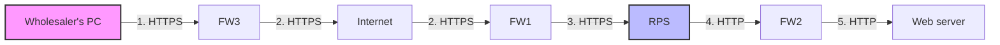

# 2022A_FE-B_1

![[2022A_FE-B_Q1_p1.png]]
![[2022A_FE-B_Q1_p2.png]]
![[2022A_FE-B_Q1_p3.png]]
![[2022A_FE-B_Q1_p4.png]]
?
Subquestion 1: b) 1, 2, 3
Subquestion 2: A: h) SQL injection, B: b) cross-site scripting, C: g) social engineering
Subquestion 3: a) Making the user specify only the name of the file to be downloaded, and if the file exists in the folder set for each wholesaler, performing download processing.
Subquestion 4: b) A person who uses a program that automatically enters possible passwords in succession may be able to log in.

### Explanation

**Subquestion 1**
The problem states: "the RPS uses the digital certificate to convert the protocol from HTTPS to HTTP." This means communication from the wholesaler's PC up to the RPS is encrypted using HTTPS. Once the traffic reaches the RPS, it is decrypted and sent as standard HTTP to the internal Web Server. 

Looking at Figure 1 and Table 2:
- **Route 1** (Wholesaler's PC $\rightarrow$ FW3): **HTTPS**
- **Route 2** (FW3 $\rightarrow$ FW1): **HTTPS** (Traversing the Internet)
- **Route 3** (FW1 $\rightarrow$ RPS): **HTTPS** (Arriving at the RPS)
- **Route 4** (FW1 $\rightarrow$ FW2): **HTTP** (Internal routing to web server)
- **Route 5** (FW2 $\rightarrow$ Web server): **HTTP** (Internal routing to web server)

Therefore, routes 1, 2, and 3 use HTTPS. (Correct Answer: **b**)

---

**Subquestion 2**
* **Blank A:** The vulnerability described is making the database server execute unexpected operations to gain unauthorized access. This is the definition of **SQL injection**, where malicious SQL statements are inserted into entry fields for execution. (Correct Answer: **h**)
* **Blank B:** The vulnerability describes an attacker embedding a script in a Web page, which can redirect users to a malicious site to steal credentials. This describes **Cross-Site Scripting (XSS)**. (Correct Answer: **b**)
* **Blank C:** Security education is provided to prevent incidents taking advantage of *human errors* (e.g., being tricked into revealing a password). This is known as **Social Engineering**. (Correct Answer: **g**)

---

**Subquestion 3**
The vulnerability (i) allows an operator to "download arbitrary files on the Web server," which describes a **Directory Traversal** attack (e.g., requesting `../../etc/passwd`). 
To prevent this, the application should strictly control file access by:
1. Allowing the user to specify *only the file name* (stripping out any relative or absolute path characters like `/` or `\`).
2. Checking if that specific file name exists in the isolated folder designated for that wholesaler. 

If the application accepts relative (b) or absolute (c) paths, attackers can manipulate the path to access unauthorized files. Displaying the folder structure (d) does not inherently secure the download mechanism. (Correct Answer: **a**)

---

**Subquestion 4**
The vulnerability (ii) states that "the user ID is not locked even when the operator repeatedly enters wrong passwords." This means there is no account lockout policy.
Without a lockout policy, an attacker can attempt to guess the password infinitely. This enables a **brute-force attack** or **dictionary attack**, where a program automatically enters possible passwords in succession until the correct one is found.
* Choice (a) is shoulder surfing.
* Choice (c) is exploiting a lost memo.
* Choice (d) is password guessing based on known information (but only a single attempt, not strictly requiring an unlimited-attempt vulnerability).
(Correct Answer: **b**)
