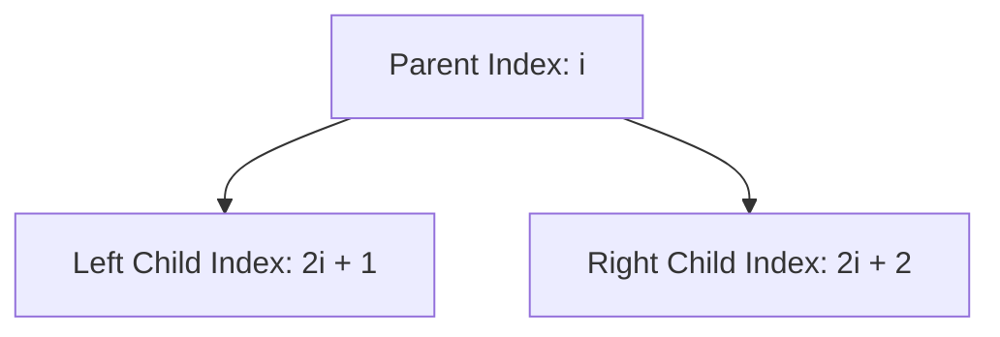

# 2022A_FE-B_7

![[2022A_FE-B_Q7_p1.png]]
![[2022A_FE-B_Q7_p2.png]]
![[2022A_FE-B_Q7_p3.png]]
![[2022A_FE-B_Q7_p4.png]]
![[2022A_FE-B_Q7_p5.png]]
![[2022A_FE-B_Q7_p6.png]]
![[2022A_FE-B_Q7_p7.png]]
?
1A: c) *b = t
1B: b) (child - 1) / 2
1C: c) parent > 0
1D: a) l_child < heap_size
1E: b) &data[parent], &data[child]
1F: a) heap_size, 0
2G: d) sizeof(data) / sizeof(Data_t)

### Explanation

#### Subquestion 1
**Blank A:**
The `swap` function is designed to swap two `Data_t` structs passed by pointer. It temporarily stores the value of `*a` in `t`, assigns `*b` to `*a`, and then must assign the temporary value `t` to `*b`. Thus, **A** is `*b = t`.

**Blank B:**
In a binary heap built on a 0-indexed array, the left child of node `i` is `2i + 1` and the right child is `2i + 2`. Conversely, to find the parent index of any child node `i`, the formula is integer division `(i - 1) / 2`. Thus, **B** is `(child - 1) / 2`.

**Blank C:**
In `heap_up`, if a child is greater than its parent, they are swapped. We must continue this process recursively up the tree until the element is either smaller than its parent or it becomes the root node (index 0). We should only recurse if the current `parent` node itself has a parent, which means `parent > 0`. Thus, **C** is `parent > 0`.

**Blank D:**
The `heap_down` function percolates a node downwards. It starts by assuming the left child (`l_child`) is the larger of the two children. However, before checking any children, we must ensure that the left child actually exists within the current heap! We do this by checking if the index is strictly less than the total size of the heap. Thus, **D** is `l_child < heap_size`.

**Blank E:**
If the chosen child's value is greater than the parent's value, they must be swapped to maintain the max-heap property. The `swap` function expects pointers. We pass the memory addresses of the parent and child elements in the array. Thus, **E** is `&data[parent], &data[child]`.

#### Subquestion 2
**Blank F:**
During the sort phase, the maximum element (at root `0`) is swapped with the last element in the unsorted portion of the array. The heap size is then decremented. After the swap, the new root element (at index 0) might violate the max-heap property, so we must percolate it downwards using `heap_down`. The function `heap_down` expects `(data, heap_size, parent_index)`. We pass the updated `heap_size` and the index of the root, which is `0`. Thus, **F** is `heap_size, 0`.

**Blank G:**
In the `main` function, the array `data` is initialized, but its length is not explicitly stored in a variable. The `rank_by_score` function requires the number of elements `n` as its second argument. In C, the number of elements in an array can be calculated by dividing the total size of the array in bytes by the size of a single element in bytes. Since the array stores `Data_t` structs, this is `sizeof(data) / sizeof(Data_t)`. Thus, **G** is `sizeof(data) / sizeof(Data_t)`.
