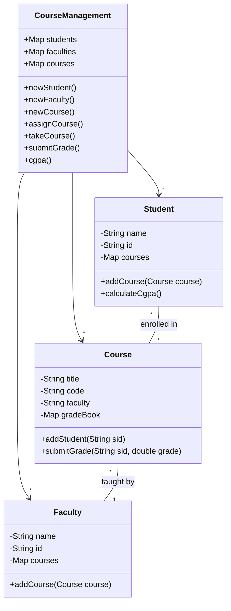

# 2022A_FE-B_8

![[2022A_FE-B_Q8_p1.png]]
![[2022A_FE-B_Q8_p2.png]]
![[2022A_FE-B_Q8_p3.png]]
![[2022A_FE-B_Q8_p4.png]]
![[2022A_FE-B_Q8_p5.png]]
![[2022A_FE-B_Q8_p6.png]]
![[2022A_FE-B_Q8_p7.png]]
?
1A: d) String, Double
1B: d) putIfAbsent(sid, 0.0) == null
1C: e) replace(sid, grade) != null
1D: c) String, Course
1E: f) course.getFaculty() == null
1F: b) course.addStudent(id)
1G: d) faculties.get(fid).addCourse(courses.get(code))
2H: d) Student: 16200, CGPA: 2.90

### Explanation

#### Subquestion 1
**Blank A:**
In the `Course` class, the `gradeBook` map stores grades for each student. The key is the student ID (`String`) and the value is the numerical grade. Since grades can have decimal points (as seen in `submitGrade(String sid, double grade)`), the value type must be the wrapper class `Double`. Thus, **A** is `String, Double`.

**Blank B:**
The `addStudent` method registers a student to the course and must return `true` on success. If the student is already registered, it must return `false`. The `putIfAbsent(key, value)` method inserts the key-value pair only if the key is not already present, and returns `null` if the insertion was successful (i.e., there was no previous value). If it returns `null`, the student was successfully added, so the method should return `true`. Thus, **B** is `putIfAbsent(sid, 0.0) == null`.

**Blank C:**
The `submitGrade` method registers the grade but must return `false` if the student has not registered for the course. The `replace(key, value)` method updates the value for a given key only if the key is currently mapped to a value. If successful, it returns the previous value (which will not be `null`). If the key is not found, it returns `null`. Therefore, to return `true` on success and `false` if the student is missing, we use `replace(sid, grade) != null`. Thus, **C** is `replace(sid, grade) != null`.

**Blank D:**
In the `Faculty` class, the `courses` map stores the courses taught by the faculty member. The key is the course code (`String`), and the value is the `Course` object itself. Thus, **D** is `String, Course`.

**Blank E:**
The `addCourse` method in `Faculty` assigns a course to a professor. The prompt states: "If he/she or another member of the faculty has already registered to the course, it returns false". We must verify that the course does not currently have an assigned faculty member before adding it. This is done by checking if `course.getFaculty() == null`. Thus, **E** is `course.getFaculty() == null`.

**Blank F:**
The `addCourse` method in `Student` adds a course for a student. The prompt states it should return `false` if "the course capacity has reached, or the student has already registered for the course". These exact checks are handled internally by the `Course.addStudent(id)` method, which returns `true` if successful and `false` if capacity is reached or the student is a duplicate. Therefore, we just need to call this method and check its result. Thus, **F** is `course.addStudent(id)`.

**Blank G:**
The `assignCourse` method in `CourseManagement` links a specific faculty member (by ID `fid`) to a specific course (by code `code`). It must retrieve the `Faculty` object from the `faculties` map, retrieve the `Course` object from the `courses` map, and then pass the `Course` object to the `Faculty`'s `addCourse` method. Thus, **G** is `faculties.get(fid).addCourse(courses.get(code))`.

#### Subquestion 2
Let's trace the operations for student `s2` ("Tamara Iqbal", ID: "16200"):
1. **Initial State:** `s2` has 24 previous credit hours with an average CGPA of 3.0.
   - Total accumulated grade points = $24 \times 3.0 = 72.0$.
2. **Courses Taken:** `s2` takes `c1` and `c2`. Each course is worth 3 credit hours.
   - New total credit hours = $24 + 3 + 3 = 30$.
3. **Grades Submitted:**
   - For `c1`, `s2` receives a grade of `3.0`. Points earned = $3.0 \times 3 = 9.0$.
   - For `c2`, `s2` receives a grade of `2.0`. Points earned = $2.0 \times 3 = 6.0$.
4. **CGPA Calculation:**
   - Total grade points = $72.0 + 9.0 + 6.0 = 87.0$.
   - New CGPA = $87.0 / 30 = 2.90$.
The output format matches `Student: 16200, CGPA: 2.90`.
