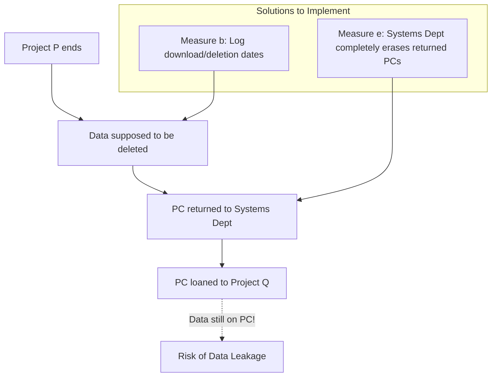

# 2022S_FE-B_1

![[2022S_FE-B_Q1_p1.png]]
![[2022S_FE-B_Q1_p2.png]]
![[2022S_FE-B_Q1_p3.png]]
![[2022S_FE-B_Q1_p4.png]]
![[2022S_FE-B_Q1_p5.png]]
![[2022S_FE-B_Q1_p6.png]]
?
**Subquestion 1:**
A: d) 8
B: a) 1

**Subquestion 2:**
d) C and I

**Subquestion 3:**
b) 2

**Subquestion 4:**
C and D: b) A user will enter... / e) The systems department will add processes...

### Explanation

#### Subquestion 1
The risk value is calculated using the formula:
$$ \text{Risk Value} = \text{Value of information asset} \times \text{Threat} \times \text{Vulnerability} $$

**For Blank A:**
This blank corresponds to the Integrity (I) risk value of Threat T5 for Customer test data.
- **Value of information asset (I):** 2 (from Table 2)
- **Threat (T5):** 2 (from Table 3)
- **Vulnerability (V5):** 2 (from Table 4)
$$ \text{Risk Value}_I = 2 \times 2 \times 2 = 8 $$
Thus, **A = 8 (d)**.

**For Blank B:**
This blank corresponds to the Availability (A) risk value of Threat T6 for Customer test data.
- **Value of information asset (A):** 1 (from Table 2)
- **Threat (T6):** 1 (from Table 3)
- **Vulnerability (V6):** 1 (from Table 4)
$$ \text{Risk Value}_A = 1 \times 1 \times 1 = 1 $$
Thus, **B = 1 (a)**.

#### Subquestion 2
In Table 2, the reasons (ii) and (iii) describe the impact on the information asset:
- **(ii) "Customers' trust would be lost if the information were leaked out of the company":** This relates to the protection against unauthorized access or leakage, which is **Confidentiality (C)**.
- **(iii) "If program versions are not controlled, there will be an impact on the progress of the project owing to inconsistency":** Inconsistency or unauthorized modification of data impacts **Integrity (I)**.
Therefore, the correct combination is **C and I (d)**.

#### Subquestion 3
We need to determine how many threats result in a risk value strictly greater than 12 in any of the categories (C, I, A). Let's calculate the missing values in Table 5:

| Threat | Calculation ($C, I, A \times T \times V$) | Risk Values (C, I, A) | Result |
| :--- | :--- | :--- | :--- |
| **T1** | $V=3, T=3, V=2$ | 18, 12, 6 | **Unacceptable (18 > 12)** |
| **T2** | $V=3, T=1, V=3$ | 9, 6, 3 | Accepted |
| **T3** | $V=3, T=2, V=1$ | 6, 4, 2 | Accepted |
| **T4** | $V=3, T=3, V=2$ | 18, 12, 6 | **Unacceptable (18 > 12)** |
| **T5** | $V=3, T=2, V=2$ | 12, 8, 4 | Accepted |
| **T6** | $V=3, T=1, V=1$ | 3, 2, 1 | Accepted |
| **T7** | $V=3, T=1, V=3$ | 9, 6, 3 | Accepted |

Since only **T1** and **T4** have risk values exceeding 12, there are **2 threats** requiring additional measures. (Answer: **b**)

#### Subquestion 4
The security incident involved customer test data being left on a development PC that was returned to the systems department and subsequently loaned to a new project (Project Q).

To prevent this specific leakage, the company needs to:
1. Ensure project members properly delete the data before returning the PC. Option **b)** enforces this by requiring an administration log entry for downloading and deleting data.
2. Ensure the systems department completely wipes the PC before loaning it out again. Option **e)** directly implements this process.
Thus, **C and D are b and e**.
