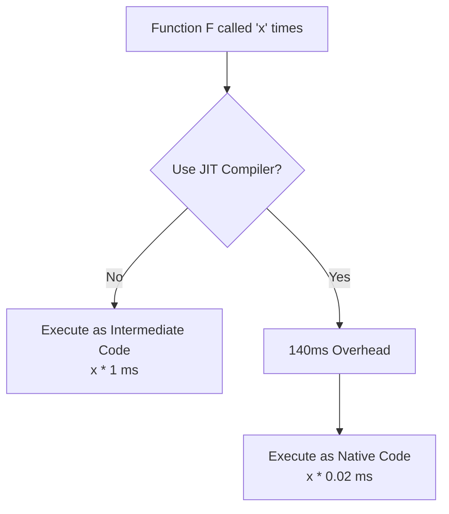

# 2022S_FE-B_2

![[2022S_FE-B_Q2_p1.png]]
![[2022S_FE-B_Q2_p2.png]]
![[2022S_FE-B_Q2_p3.png]]
![[2022S_FE-B_Q2_p4.png]]
?
**Subquestion 1:**
A: d) can optimize the executable program for the target computer

**Subquestion 2:**
B: a) is independent of any specific OS or hardware

**Subquestion 3:**
C: g) 140
D: b) 2
E: c) 142

### Explanation

#### Subquestion 1
A compiler translates the entire source program into machine-readable instructions ahead of time. Unlike an interpreter, which analyzes code on the fly and often executes it sequentially without looking at the broader context, a compiler performs deep analysis and can perform advanced optimizations (e.g., register allocation, dead code elimination, loop unrolling) specific to the target hardware architecture before the program is executed.
Thus, **A = d**.

#### Subquestion 2
A virtual machine executes "intermediate code," abstracting away the underlying physical hardware. This allows the compiler to generate a single intermediate code file, which can then be distributed to any machine (regardless of its physical architecture or OS), provided a compatible virtual machine is installed to execute that intermediate code. 
Thus, **B = a**.

#### Subquestion 3
We need to calculate the execution times based on the given constraints.

**Given values:**
- Intermediate-code execution time: $0.5 \mu\text{s}$
- Native-code execution time: $0.01 \mu\text{s}$
- Function F executes 2,000 instructions per call.

**Execution time per call:**
- **Intermediate Code:** 
  $$ 2,000 \text{ inst} \times 0.5 \mu\text{s} = 1,000 \mu\text{s} = 1 \text{ ms} $$
- **Native Code:** 
  $$ 2,000 \text{ inst} \times 0.01 \mu\text{s} = 20 \mu\text{s} = 0.02 \text{ ms} $$

**For Blank C (Execution time for dynamic compilation):**
The compilation happens at the start of the 101st call.
- **Startup time:** $100 \text{ ms}$
- **Compilation time:** It takes 100 ms to compile 1,000 instructions. Function F has 400 unique instructions.
  $$ \text{Compile Time} = \frac{400}{1000} \times 100 \text{ ms} = 40 \text{ ms} $$
- **Total compilation overhead:** 
  $$ 100 \text{ ms} + 40 \text{ ms} = 140 \text{ ms} $$
Thus, **C = 140 (g)**.

**For Blank D (Total execution time for the last 100 calls):**
After dynamic compilation, the function runs entirely as native code.
$$ 100 \text{ calls} \times 0.02 \text{ ms/call} = 2 \text{ ms} $$
Thus, **D = 2 (b)**.

**For Blank E (Tradeoff threshold):**
Let $x$ be the number of times Function F is called. We want to find the breakeven point where compiling before the first call is faster than never compiling.

To find when dynamic compilation becomes faster, we solve the inequality:
$$ x \times 1 > 140 + x \times 0.02 $$
$$ 0.98x > 140 $$
$$ x > \frac{140}{0.98} $$
$$ x > 142.857 $$
This means the dynamic compiler reduces the total execution time if the function is called more than 142 times.
Thus, **E = 142 (c)**.
