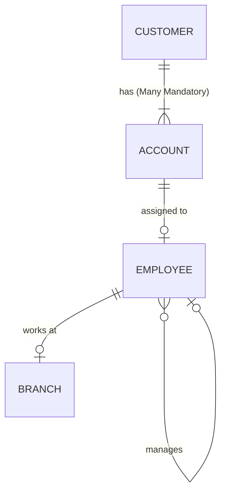

# 2022S_FE-B_3

![[2022S_FE-B_Q3_p1.png]]
![[2022S_FE-B_Q3_p2.png]]
![[2022S_FE-B_Q3_p3.png]]
![[2022S_FE-B_Q3_p4.png]]
![[2022S_FE-B_Q3_p5.png]]
?
**Subquestion 1:**
A: c) `>|` (Many Mandatory)

**Subquestion 2:**
B: e) Employee
C: f) S.EmpID = E.SuperiorEmpID

**Subquestion 3:**
D: a) 2 rows of account IDs: 50001 and 50003
E: d) change "EXISTS" to "NOT EXISTS" on line 4

### Explanation

#### Subquestion 1
The Entity Relationship Diagram (ERD) indicates the relationship between a `Customer` and an `Account`.



- The problem description states: *"A customer can make an application for multiple types of cards. During the first account registration, customer registration is also carried out. Therefore, each registered customer has at least one account."*
- Because a single customer can have **one or more** accounts, the cardinality on the `Account` side must be **Many**.
- Because every customer must have **at least one** account, the existence is **Mandatory**.
- Therefore, the termination point **A** (which connects from the `has` diamond to `Account`) should be the "Many Mandatory" symbol `>|`.
Thus, **A = c**.

#### Subquestion 2
The goal of the SQL statement is to output employees alongside the names of their superiors.
- This requires joining the `Employee` table with itself (a Self Join).
- `E` is the alias for the Employee table representing the subordinate, and `S` is the alias for the superior.
- Therefore, Blank **B** must be the `Employee` table. 
- The condition to link an employee to their superior is that the superior's `EmpID` must match the employee's `SuperiorEmpID`.
- Therefore, Blank **C** must be `S.EmpID = E.SuperiorEmpID`.
Thus, **B = e** and **C = f**.

#### Subquestion 3
**For Blank D:**
The current SQL query uses the `EXISTS` keyword:
```sql
SELECT A.AcctID FROM Account A
WHERE EXISTS(SELECT * FROM Trans2Years T WHERE A.AcctID = T.AcctID)
AND YEAR(OpenDate) < 2020
```
This query fetches all accounts that were opened before 2020 **AND** have at least one transaction in 2020 or 2021 (because they exist in the `Trans2Years` table).
Looking at the `Account` table:
- 50001 (Registered 2016-08-26, exists in `Trans2Years`) $\rightarrow$ Selected
- 50002 (Registered 2017-04-27, not in `Trans2Years`) $\rightarrow$ Filtered out
- 50003 (Registered 2018-01-02, exists in `Trans2Years`) $\rightarrow$ Selected
- 50004 (Registered 2019-09-19, not in `Trans2Years`) $\rightarrow$ Filtered out
- 50005 (Registered 2020-04-16) $\rightarrow$ Filtered out (Registered $\ge 2020$)
- 50006 (Registered 2021-01-10) $\rightarrow$ Filtered out (Registered $\ge 2020$)

It will output exactly 2 rows: **50001 and 50003**. Thus, **D = a**.

**For Blank E:**
To satisfy the original requirement (output account IDs registered before 2020 and **never used** in 2020 and 2021), we need to select the accounts that **do not** have any corresponding records in the `Trans2Years` table.
Changing `EXISTS` to `NOT EXISTS` perfectly achieves this exclusion.
Thus, **E = d**.
