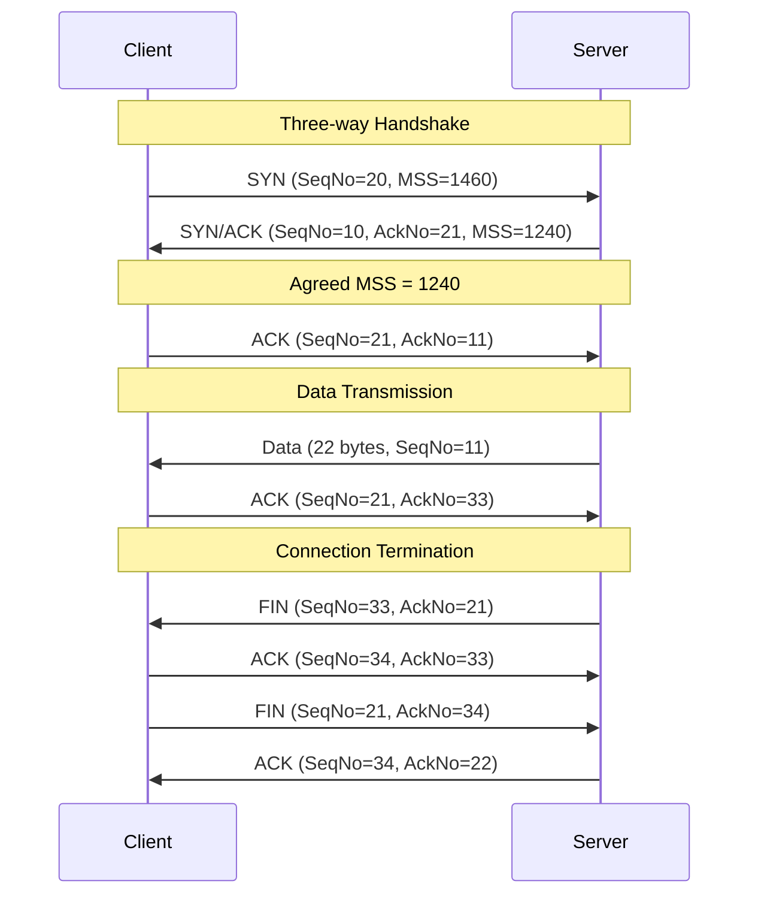

# 2022S_FE-B_4

![[2022S_FE-B_Q4_p1.png]]
![[2022S_FE-B_Q4_p2.png]]
![[2022S_FE-B_Q4_p3.png]]
![[2022S_FE-B_Q4_p4.png]]
![[2022S_FE-B_Q4_p5.png]]
?
**Subquestion 1:**
A: a) 1240
B: e) 33
C: a) ACK
D: b) FIN
E: c) 21

**Subquestion 2:**
F: c) Owing to the connection-oriented nature of TCP...

### Explanation

#### Subquestion 1
During the TCP three-way handshake and subsequent data exchange, Sequence numbers (`SeqNo`), Acknowledgment numbers (`AckNo`), and Maximum Segment Sizes (`MSS`) are negotiated.

**For Blank A:**
The `MSS` (Maximum Segment Size) used for the connection is determined by the lowest `MSS` advertised by either party.
- Client advertised `MSS = 1460`
- Server advertised `MSS = 1240`
Therefore, the agreed segment size is **1240 bytes (a)**.

**For Blanks B, C, D, and E:**
Let's trace the Sequence (`SeqNo`) and Acknowledgment (`AckNo`) numbers:
1. **Client SYN:** `SeqNo = 20`
2. **Server SYN/ACK:** `SeqNo = 10`, `AckNo = 21` (Client's `SeqNo 20` + 1)
3. **Client ACK:** `SeqNo = 21`, `AckNo = 11` (Server's `SeqNo 10` + 1)

Now data transmission occurs:
4. **Server Data:** The server sends 22 bytes of data. Its sequence number starts where its last `AckNo` left off: `SeqNo = 11`.
5. **Client ACK (Data):** The client acknowledges receiving 22 bytes. Its `AckNo` becomes the server's `SeqNo` (11) + data length (22) = `33`.

Now the server initiates connection termination:
6. **Server FIN:** The server sends a termination request. Its `SeqNo` will be the value the client expects next, which is **33**. Thus, **B = 33 (e)**.
7. **Client ACK (FIN):** The client responds to the FIN packet. Since FIN packets consume 1 sequence number, the client's `AckNo` becomes Server's `SeqNo` (33) + 1 = `34`. This is an **ACK** packet. Thus, **C = ACK (a)**.
8. **Client FIN:** Since the client is also ready to terminate, it sends a **FIN** packet to the server. Thus, **D = FIN (b)**.
9. **Client FIN (SeqNo):** Since the client has not sent any data payload (only ACKs, which consume 0 sequence numbers), its `SeqNo` remains the same as it was after the handshake, which is **21**. Thus, **E = 21 (c)**.

#### Subquestion 2
A **SYN Flood attack** exploits the TCP three-way handshake by sending a barrage of SYN requests without ever completing the handshake (by omitting the final ACK).
- The server allocates resources and places these half-open connections in its backlog queue, waiting for the ACKs.
- Once the backlog queue fills up, the server can no longer accept any *new* legitimate connection requests.
- However, connections that have *already been fully established* are not placed in this queue and thus remain unaffected. 
Therefore, SYN flooding prevents **new clients** from connecting rather than disconnecting already established connections.
Thus, the correct answer is **c**.
