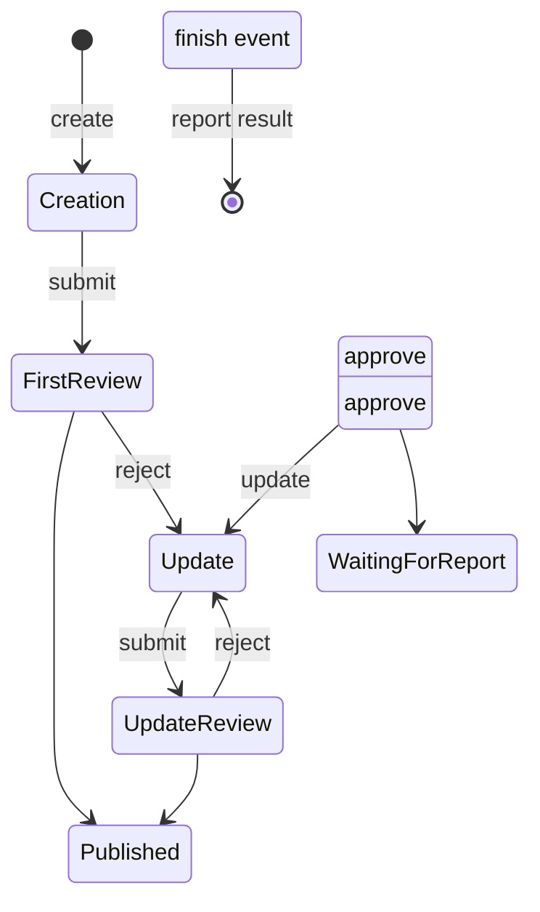

# 2022S_FE-B_5

![[2022S_FE-B_Q5_p1.png]]
![[2022S_FE-B_Q5_p2.png]]
![[2022S_FE-B_Q5_p3.png]]
![[2022S_FE-B_Q5_p4.png]]
![[2022S_FE-B_Q5_p5.png]]
?
**Subquestion 1:**
- A: d) Set authority for the Organizer
- B: e) Update information
- C: c) Review information

**Subquestion 2:**
- D: f) Verify information
- E: a) Publish information

**Subquestion 3:**
- F: a) F1: Waiting for report, F2: Published

### Explanation

**Subquestion 1: Use Case Diagram**
Based on the system description:
1. **Blank A:** The Administrator's role is to manage users and grant authority. When a student becomes a leader, the Administrator sets the authority for the Organizer. Thus, **A = d (Set authority for the Organizer)**.
2. **Blank B:** The Organizer can create, update, and submit event information. Since "Create information" and "Report result" are already mentioned (though shaded/hidden in the diagram), the missing action related to managing event information is updating it. Thus, **B = e (Update information)**.
3. **Blank C:** The Manager's role is to review the event information submitted by Organizers and decide whether to approve or reject it. Thus, **C = c (Review information)**.

**Subquestion 2: Activity Diagram**
The activity diagram models the step-by-step process of organizing an event.
1. **Blank D (SEC System's Action):** After the Organizer creates an event, the SEC system must check the database for reasonableness (budget, equipment). This corresponds to verifying the information before sending it to the Manager. Thus, **D = f (Verify information)**.
2. **Blank E (SEC System's Action after Manager's Approval):** When the Manager approves the event, the event becomes public and open to students. The SEC system is responsible for making it public. Thus, **E = a (Publish information)**.

**Subquestion 3: State Chart**
The state chart illustrates the lifecycle of the event information.
- When an event is approved in the "First Review" or "Update Review", it transitions to the **Published** state. This is where it is visible to students. 
- After the event ends (`finish event`), the Organizer must report the result. While the system waits for this report, the state transitions to **Waiting for report**.
- Therefore, the state before reporting the result is **F1 = Waiting for report**, and the state after approval is **F2 = Published**. Thus, **F = a**.

---
