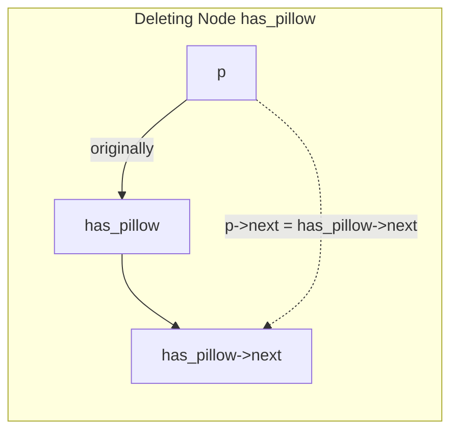

# 2022S_FE-B_7

![[2022S_FE-B_Q7_p1.png]]
![[2022S_FE-B_Q7_p2.png]]
![[2022S_FE-B_Q7_p3.png]]
![[2022S_FE-B_Q7_p4.png]]
![[2022S_FE-B_Q7_p5.png]]
![[2022S_FE-B_Q7_p6.png]]
![[2022S_FE-B_Q7_p7.png]]
?
**Subquestion 1:**
- A: d) `win`
- B: b) `i`
- C: d) `players->next != players`
- D: d) `p->next = has_pillow->next`
- E: d) `temp = temp->next`

**Subquestion 2:**
- F: d) 4

**Subquestion 3:**
- G: c) `/*** γ ***/`
- H: a) `has_pillow = p`

### Explanation

**Subquestion 1: Missing C Code Statements**
1. **Blank A:** The main function calls `win = PlayGame(players);` which returns the winning player's number. Therefore, to print the winner, we just output `win`. Thus, **A = d**.
2. **Blank B:** The loop runs from `i = 1` to `num_players`. The nodes must hold a unique number identifying the player (from 1 to `num_players`). Thus, we set `temp->number = i;`. **B = b**.
3. **Blank C:** The loop should continue until there is only one player left. In a circular linked list, a list with only one node will point to itself (`players->next == players`). The loop continues as long as this is false. Thus, `players->next != players`. **C = d**.
4. **Blank D:** This code deletes `has_pillow` from the circular list. The pointer `p` points to the node immediately *before* `has_pillow`. To skip `has_pillow`, we re-link the list by setting `p`'s next pointer to `has_pillow`'s next node. Thus, `p->next = has_pillow->next;`. **D = d**.
5. **Blank E:** Inside `Display`, we iterate over all nodes. To move the pointer to the next node in each iteration, we do `temp = temp->next`. **E = d**.

**Subquestion 2: Simulating the Game**
Initial list: `[1] -> [2] -> [3] -> [4] -> [5] -> (back to 1)`
`has_pillow` starts at `1`. `p` tracks the node behind `has_pillow`.

| Round | `rd` | Current `has_pillow` | Target after `rd` moves | Eliminated Node | New `has_pillow` (`p->next`) | Remaining List |
|-------|-------|---------------------|------------------------|-----------------|-----------------------------|----------------|
| 1     | 4     | `1`                 | `1` + 4 = `5`          | **Player 5**    | `1`                         | 1, 2, 3, 4     |
| 2     | 2     | `1`                 | `1` + 2 = `3`          | **Player 3**    | `4`                         | 1, 2, 4        |
| 3     | 1     | `4`                 | `4` + 1 = `1`          | **Player 1**    | `2`                         | 2, 4           |
| 4     | 2     | `2`                 | `2` + 2 = `2`          | **Player 2**    | `4`                         | 4              |

After the 4th elimination, the only remaining player is `4`. Thus, **F = d**.

**Subquestion 3: Specification Change**
The original code sets `has_pillow = p->next;` after an elimination (line `/*** γ ***/`), meaning the pillow starts moving from the player *after* the eliminated player. 
The new specification states the pillow should start moving from the player *immediately before* the eliminated player. Since pointer `p` holds the node exactly before the deleted player, we must change `has_pillow = p->next;` to `has_pillow = p;`.
- The line to change is `/*** γ ***/`. Thus, **G = c**.
- The replacement line is `has_pillow = p`. Thus, **H = a**.

