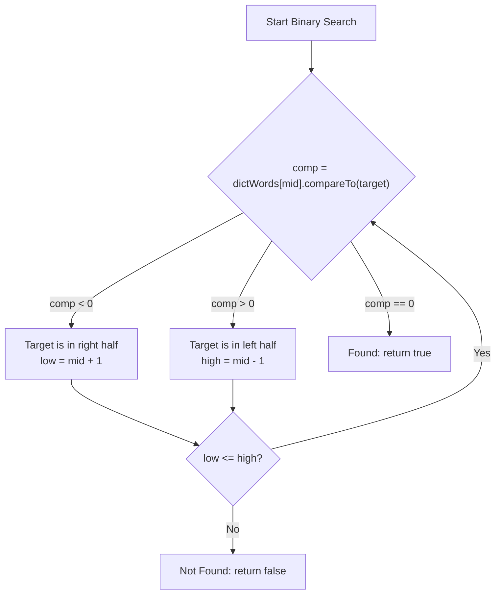

# 2022S_FE-B_8

![[2022S_FE-B_Q8_p1.png]]
![[2022S_FE-B_Q8_p2.png]]
![[2022S_FE-B_Q8_p3.png]]
![[2022S_FE-B_Q8_p4.png]]
![[2022S_FE-B_Q8_p5.png]]
![[2022S_FE-B_Q8_p6.png]]
![[2022S_FE-B_Q8_p7.png]]
![[2022S_FE-B_Q8_p8.png]]
?
**Subquestion 1:**
- A: d) `element.equals(lowerCaseWord)`
- B: b) `index < dictWords.length`
- C: e) `index++`
- D: d) `==`

**Subquestion 2:**
- E: a) `"("`
- F: d) `"?"`
- G: c) `"/"`

**Subquestion 3:**
- H: d) `mid + 1`
- I: e) `mid - 1`

### Explanation

**Subquestion 1: Basic String Operations and Iterators**
1. **Blank A (String comparison):** In Java, strings must be compared using the `.equals()` method rather than the `==` operator, which only compares object references. Thus, to check if the dictionary element matches the input word, we use `element.equals(lowerCaseWord)`. **A = d**.
2. **Blank B (Iterator `hasNext` condition):** An iterator has next elements as long as the current `index` is strictly less than the total length of the array (`dictWords.length`). Thus, **B = b**.
3. **Blank C (Iterator `next` action):** The `next()` method must return the element at the current index, and *then* increment the index for the next call. The post-increment operator `index++` achieves this perfectly. Thus, **C = e**.
4. **Blank D (Substitution Cost):** The `getSubstitutionCost` method returns `0` if the two characters are identical, and `2` if they differ. To check for character equality, we use the `==` operator. Thus, **D = d**.

**Subquestion 2: String Building for Output**
The `checkSentence` method formats missing dictionary words as either `OriginalWord(/alt1/alt2/...)` or `OriginalWord(?)`.
1. **Blank E (Opening the alternatives):** Once we determine a word is absent from the dictionary, we must append a left parenthesis to start the alternatives list. Thus, `suggestions.append("(");`. **E = a**.
2. **Blank F (No alternatives found):** If `suggestedWords.isEmpty()` is true, no close matches exist. The specification requires a question mark inside the parentheses. Thus, `suggestions.append("?");`. **F = d**.
3. **Blank G (Separator):** When appending the suggested alternatives, each word must be prefixed by a slash `/`. Thus, `suggestions.append("/");`. **G = c**.

**Subquestion 3: Binary Search Implementation**
The binary search algorithm efficiently searches a sorted array by repeatedly dividing the search interval in half.
- If `dictWords[mid].compareTo(lowerCaseWord)` evaluates to a negative number (`comp < 0`), it means the `mid` element is lexicographically *less than* the target word. Thus, the target word must exist in the right half of the array. The lower bound must be moved past `mid`: `low = mid + 1`. **H = d**.
- Conversely, if `comp > 0`, the `mid` element is *greater than* the target word. The target must exist in the left half, so the upper bound must be moved: `high = mid - 1`. **I = e**.

