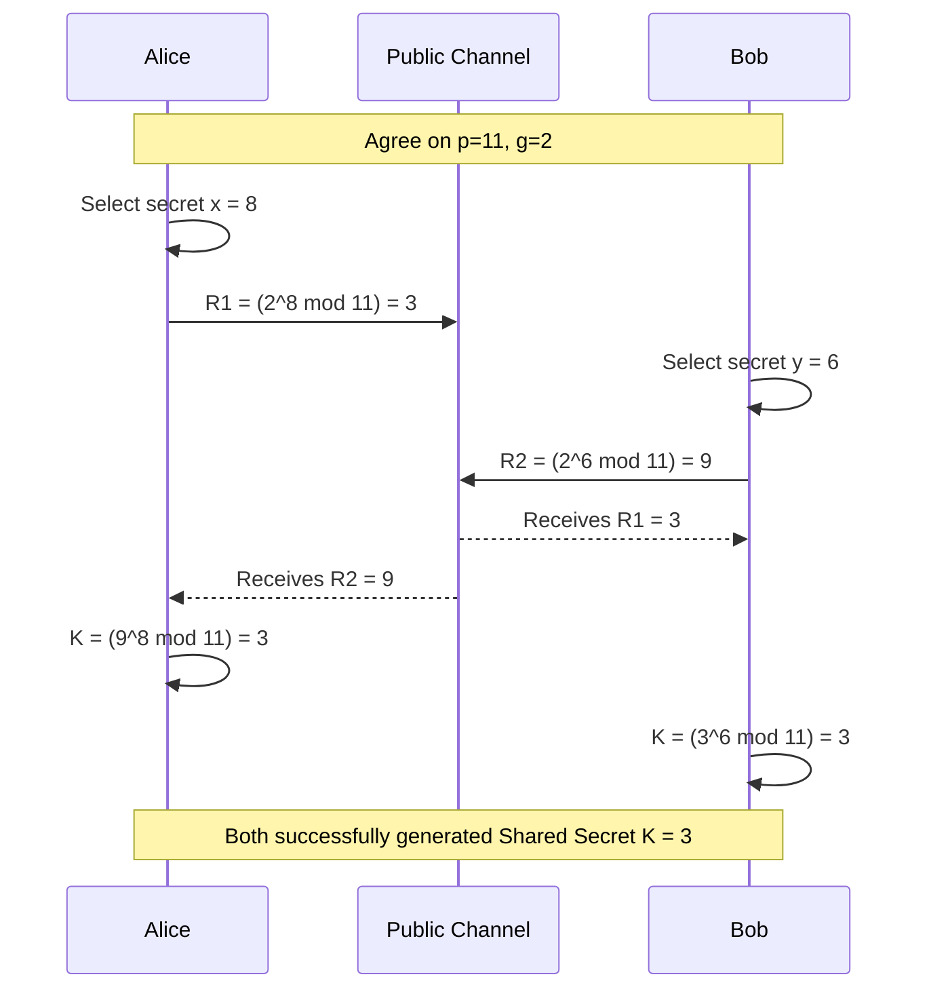

# 2023A_FE-B_1

![[2023A_FE-B_Q1_p1.png]]
![[2023A_FE-B_Q1_p2.png]]
![[2023A_FE-B_Q1_p3.png]]
?
**Subquestion 1**
- **A:** h) 8
- **B:** f) 6
- **C:** c) 3

**Subquestion 2**
- **D:** e) 5
- **E:** g) 1 billion

### Explanation

#### Subquestion 1: Determining $x, y,$ and $K$
The Diffie-Hellman key exchange algorithm allows Alice and Bob to compute a shared secret over an insecure channel. 
Given: $p = 11$ and $g = 2$.

1. **Finding Alice's secret $x$ (Blank A):**
Alice sends $R_1 = 3$. The formula for $R_1$ is:
$R_1 = g^x \bmod p \implies 2^x \bmod 11 = 3$
Using Table 1 from the question:
- For $n = 8$, $2^8 \bmod 11 = 3$. 
Thus, Alice's secret $x = 8$.

2. **Finding Bob's secret $y$ (Blank B):**
Bob sends $R_2 = 9$. The formula for $R_2$ is:
$R_2 = g^y \bmod p \implies 2^y \bmod 11 = 9$
Using Table 1 from the question:
- For $n = 6$, $2^6 \bmod 11 = 9$.
Thus, Bob's secret $y = 6$.

3. **Calculating the shared secret key $K$ (Blank C):**
Both Alice and Bob can compute the same $K$.
Alice computes: $K = (R_2)^x \bmod p = 9^8 \bmod 11$
Bob computes: $K = (R_1)^y \bmod p = 3^6 \bmod 11$
Let's compute Bob's equation since it has smaller numbers:
$3^6 = (3^3)^2 = 27^2 = 729$
$729 \bmod 11 = 3$ (since $729 = 66 \times 11 + 3$)
Alternatively, using properties of modulo:
$27 \bmod 11 = 5 \implies 5^2 \bmod 11 = 25 \bmod 11 = 3$.
Thus, the shared secret key $K = 3$.

#### Subquestion 2: Eve's Attack and Brute-Force Complexity
1. **Determining $K$ with leaked $y$ (Blank D):**
Given: $p = 11$, $g = 7$, and Alice's public value $R_1 = 3$.
Eve illegally obtains Bob's secret $y = 3$.
To find the shared key $K$, Eve can use Bob's calculation method because she knows both $R_1$ and $y$:
$K = (R_1)^y \bmod p$
$K = 3^3 \bmod 11 = 27 \bmod 11 = 5$.

2. **Brute-force time estimation (Blank E):**
A brute force attack must check up to $p$ values. If $p \approx 2^{120}$, there are $2^{120}$ possible values for $x$.
Eve can check $2^{90}$ values per year.
The time required to check all possibilities is:
$\text{Years} = \frac{2^{120}}{2^{90}} = 2^{120 - 90} = 2^{30}$
Using the approximation $2^{10} \approx 10^3$ (or $1,000$):
$2^{30} = (2^{10})^3 \approx (10^3)^3 = 10^9 = 1,000,000,000$ years.
This corresponds to 1 billion years.
