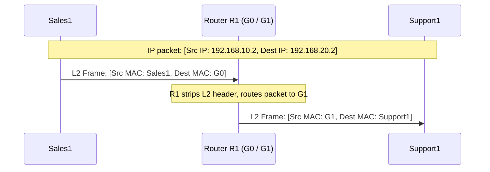

# 2023A_FE-B_4

![[2023A_FE-B_Q4_p1.png]]
![[2023A_FE-B_Q4_p2.png]]
![[2023A_FE-B_Q4_p3.png]]
![[2023A_FE-B_Q4_p4.png]]
![[2023A_FE-B_Q4_p5.png]]
?
**Subquestion 1**
- **A:** c) 2, 3, 4, and 5
- **B:** c) ARP request
- **C:** e) MAC address
- **D:** a) default gateway

**Subquestion 2**
- **E:** f) 
- **F:** h) 

### Explanation

#### Subquestion 1: ARP Request Flooding and Gateway Resolution
1. **ARP Broadcast (Blank A):** 
   ARP requests are broadcast frames (Destination MAC is `FF:FF:FF:FF:FF:FF`). When a layer-2 switch receives a broadcast frame, it floods the frame out of all active ports except the incoming port. 
   Sales1 is connected to port 1. The switch L2SW#1 has active ports 1, 2, 3, 4, and 5 (where port 5 connects to Router R1). Thus, the ARP request from Sales1 is forwarded to ports **2, 3, 4, and 5**.
2. **Cross-Network Communication (Blanks B, C, D):**
   Sales1 and Support2 belong to different subnets (Sales LAN and Support LAN). A PC cannot use ARP to directly resolve the MAC address of a device in another network because routers block broadcast traffic.
   Instead, the PC must send the packet to its local router interface (its default gateway). To do this, Sales1 sends an **ARP request (B)** to find out the **MAC address (C)** of the **default gateway (D)**.

#### Subquestion 2: Packet Encapsulation and Routing
When sending a packet across a router, the **IP addresses (Source and Destination) remain unchanged** from end to end, but the **MAC addresses (Layer-2 headers) are rewritten** at every router hop.

1. **Frame leaving Sales1 (Blank E1, E2):**
   - **Source IP:** `192.168.10.2` (Sales1)
   - **Destination IP:** `192.168.20.2` (Support1) $\rightarrow$ This is **E2**.
   - **Source MAC:** `00:00:5E:00:53:11` (Sales1)
   - **Destination MAC:** The packet must first reach the default gateway on the Sales LAN, which is interface G0 of R1. From Table 4, G0's MAC address is `00:00:5E:00:53:AA` $\rightarrow$ This is **E1**.
   This corresponds to option **f** (00:00:5E:00:53:AA and 192.168.20.2).

2. **Frame arriving at Support1 (Blank F1, F2):**
   - **Source IP:** `192.168.10.2` (Sales1) $\rightarrow$ This is **F2** (IP addresses do not change).
   - **Destination IP:** `192.168.20.2` (Support1)
   - **Source MAC:** The router R1 forwards the frame out of its G1 interface into the Support LAN. It rewrites the source MAC to be its own exit interface MAC (G1). From Table 4, G1's MAC address is `00:00:5E:00:53:BB` $\rightarrow$ This is **F1**.
   - **Destination MAC:** `00:00:5E:00:53:55` (Support1)
   This corresponds to option **h** (00:00:5E:00:53:BB and 192.168.10.2).

