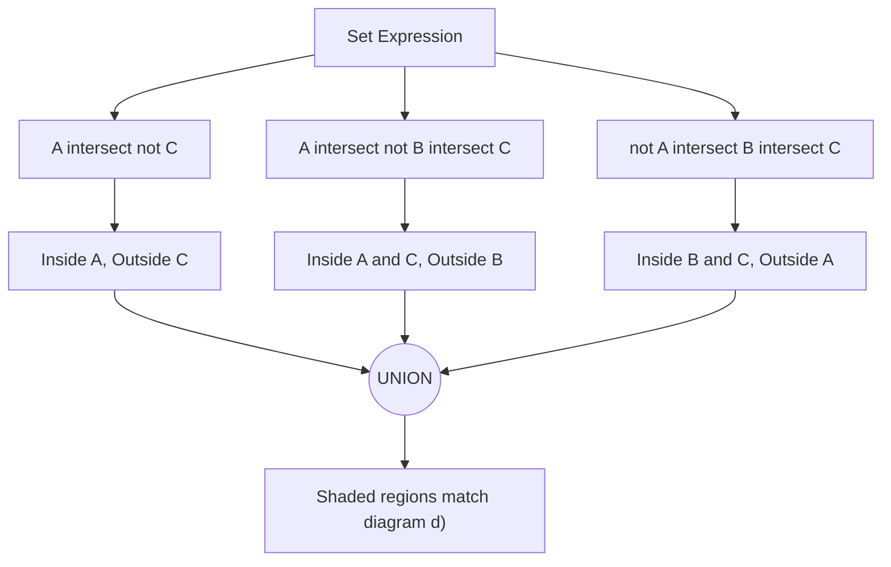

# 2023S_FE-A_1

![[2023S_FE-A_Q1_full.png]]
?
d)

### Explanation
The given set expression is:
$(A \cap \bar{C}) \cup (A \cap \bar{B} \cap C) \cup (\bar{A} \cap B \cap C)$

We can break down this expression into three distinct regions that are combined using the union operator $\cup$.

| Expression | Meaning | Region in Venn Diagram |
| :--- | :--- | :--- |
| $(A \cap \bar{C})$ | Elements in $A$ but not in $C$ | Top part of circle $A$ (excluding its intersection with $C$) |
| $(A \cap \bar{B} \cap C)$ | Elements in $A$ and $C$, but not in $B$ | The left part of the intersection between $A$ and $C$ |
| $(\bar{A} \cap B \cap C)$ | Elements in $B$ and $C$, but not in $A$ | The right part of the intersection between $B$ and $C$ |

