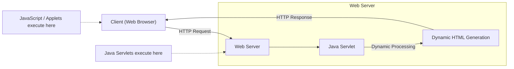

# 2023S_FE-A_10

Which of the following is a program that achieves dynamic processing in a web environment and operates only on a web server? 

a) JavaScript 
b) Java applet 
c) Java servlet 
d) VBScript 
?
c) Java servlet

### Explanation
A **Java servlet** is a Java software component that extends the capabilities of a server. Servlets can respond to any types of requests, but they most commonly implement applications hosted on Web servers, acting as a dynamic processing backend.

| Program / Technology | Where it Operates | Description |
| :--- | :--- | :--- |
| **a) JavaScript** | Mostly Client-Side | Scripting language typically run in the user's web browser to create interactive web pages. |
| **b) Java applet** | Client-Side | Small Java application historically embedded in a web page and executed by the user's browser (now obsolete). |
| **c) Java servlet** | **Server-Side Only** | Java class that operates on the web server to process HTTP requests and generate dynamic web content. |
| **d) VBScript** | Mostly Client-Side / Legacy | Scripting language historically used in browsers (IE) or legacy server environments (Classic ASP). |

