# 2023S_FE-A_18

![[2023S_FE-A_Q18_full.png]]
?
b) 4.75

### Explanation

We need to calculate the average waiting time for processes P1, P2, P3, and P4 using **preemptive Shortest Remaining Time First (SRTF)** scheduling. 

In SRTF, at every instant a new process arrives, the scheduler evaluates the remaining CPU-burst time of all available processes. The process with the absolute *shortest remaining time* is scheduled. If a new process arrives with a shorter burst time than the currently running process, the current process is preempted.

Let's trace the execution step-by-step using a Gantt chart.

#### 1. Execution Trace

*   **Time 0:** P1 arrives. Only P1 is in the ready queue.
    *   **P1** starts executing. (Remaining: P1 = 8)
*   **Time 2:** P2 arrives. 
    *   P1 has executed for 2ms. Remaining: P1 = $8 - 2 = 6$.
    *   P2 arrives with burst time 3.
    *   Compare remaining times: P2 (3) < P1 (6).
    *   **P2 preempts P1**. **P2** starts executing. (Remaining: P1 = 6, P2 = 3)
*   **Time 3:** P3 arrives.
    *   P2 has executed for 1ms. Remaining: P2 = $3 - 1 = 2$.
    *   P3 arrives with burst time 7.
    *   Compare remaining times: P2 (2) < P1 (6) < P3 (7).
    *   **P2** continues executing. 
*   **Time 5:** P4 arrives. P2 finishes executing simultaneously.
    *   P2 executed for 2 more ms and finishes! (Total P2 time = 3).
    *   P4 arrives with burst time 4.
    *   Available processes and remaining times: P4 (4) < P1 (6) < P3 (7).
    *   **P4** starts executing.
*   **Time 9:** P4 finishes.
    *   P4 executed for 4ms and finishes!
    *   Available processes and remaining times: P1 (6) < P3 (7).
    *   **P1** resumes executing.
*   **Time 15:** P1 finishes.
    *   P1 executed for its remaining 6ms and finishes!
    *   Available processes: P3 (7).
    *   **P3** starts executing.
*   **Time 22:** P3 finishes.

#### 2. Gantt Chart

```mermaid
gantt
    title SRTF Scheduling Gantt Chart
    dateFormat  X
    axisFormat %s

    section CPU
    P1 (0-2)   :p1_1, 0, 2
    P2 (2-5)   :p2, 2, 5
    P4 (5-9)   :p4, 5, 9
    P1 (9-15)  :p1_2, 9, 15
    P3 (15-22) :p3, 15, 22
```

#### 3. Waiting Time Calculation

The waiting time is the total time a process spends in the ready queue waiting to be executed.
Formula: $\text{Waiting Time} = \text{Turnaround Time} - \text{Burst Time}$
Where: $\text{Turnaround Time} = \text{Completion Time} - \text{Arrival Time}$

Alternatively, you can sum the durations where the process arrived but wasn't running:
*   **P1:** Arrived at 0. Ran 0-2. Waited from 2 to 9 (7ms). Ran 9-15. $\rightarrow$ **Wait = 7ms**
*   **P2:** Arrived at 2. Ran immediately from 2-5. $\rightarrow$ **Wait = 0ms**
*   **P3:** Arrived at 3. Waited until 15 (12ms). Ran 15-22. $\rightarrow$ **Wait = 12ms**
*   **P4:** Arrived at 5. Ran immediately from 5-9. $\rightarrow$ **Wait = 0ms**

| Process | Arrival | Burst | Completion | Turnaround (Completion - Arrival) | Waiting Time (Turnaround - Burst) |
| :---: | :---: | :---: | :---: | :---: | :---: |
| **P1** | 0 | 8 | 15 | 15 - 0 = 15 | 15 - 8 = **7** |
| **P2** | 2 | 3 | 5 | 5 - 2 = 3 | 3 - 3 = **0** |
| **P3** | 3 | 7 | 22 | 22 - 3 = 19 | 19 - 7 = **12** |
| **P4** | 5 | 4 | 9 | 9 - 5 = 4 | 4 - 4 = **0** |
| **Total** | | | | | **19** |

#### 4. Average Waiting Time

$$ \text{Average Waiting Time} = \frac{7 + 0 + 12 + 0}{4} = \frac{19}{4} = \mathbf{4.75} $$
