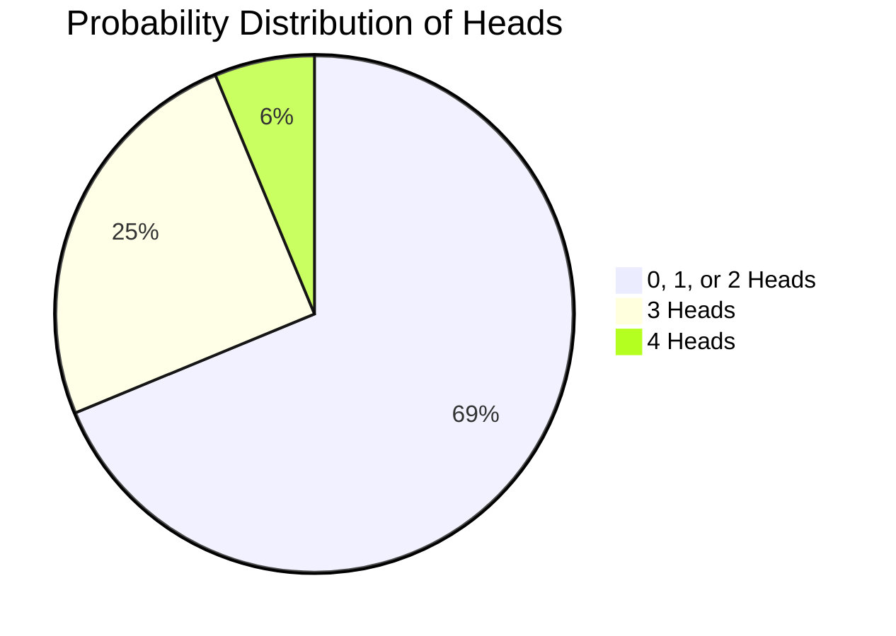

# 2023S_FE-A_3

What is the probability that at least three coins land heads up when four unbiased coins are tossed simultaneously? 

a) 1/4 
b) 5/16 
c) 3/8 
d) 5/8 
?
b) 5/16

### Explanation
When four unbiased coins are tossed, each coin has a probability of landing heads up as $P(H) = \frac{1}{2}$ and tails up as $P(T) = \frac{1}{2}$. The total number of possible outcomes is $2^4 = 16$.

We are looking for the probability of getting **at least three heads**. This means we need the probability of getting exactly 3 heads plus the probability of getting exactly 4 heads.

Using the binomial probability formula:
$P(X = k) = \binom{n}{k} \cdot p^k \cdot (1-p)^{n-k}$

| Event | Calculation | Value |
| :--- | :--- | :--- |
| **Exactly 3 Heads** | $\binom{4}{3} \cdot \left(\frac{1}{2}\right)^3 \cdot \left(\frac{1}{2}\right)^1 = 4 \cdot \frac{1}{16}$ | $\frac{4}{16}$ |
| **Exactly 4 Heads** | $\binom{4}{4} \cdot \left(\frac{1}{2}\right)^4 \cdot \left(\frac{1}{2}\right)^0 = 1 \cdot \frac{1}{16}$ | $\frac{1}{16}$ |

**Total Probability:**
$P(X \geq 3) = P(X = 3) + P(X = 4)$
$P(X \geq 3) = \frac{4}{16} + \frac{1}{16} = \frac{5}{16}$

