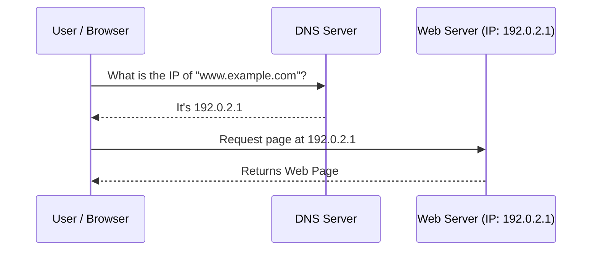

# 2023S_FE-A_31

Which of the following is a role of DNS in a TCP/IP network?

a) A private IP address is translated into a global IP address in order to access the Internet.
b) A program in a server can be invoked only by its name without taking the server’s IP address into consideration.
c) Domain names, host names, and other such information are mapped to IP addresses.
d) In response to an assignment request for an IP address from a PC or a printer, an unused address is chosen from the addresses registered in the server.
?
c) Domain names, host names, and other such information are mapped to IP addresses.

### Explanation

**DNS (Domain Name System)** acts as the phonebook of the Internet. Humans access information online through domain names, like `google.com`. Web browsers, however, interact through Internet Protocol (IP) addresses. DNS translates domain names to IP addresses so browsers can load Internet resources.

| Option | Technology | Explanation |
|---|---|---|
| a | NAT (Network Address Translation) | Translates private IP addresses to global/public IP addresses. |
| b | RPC / RMI | Relates to Remote Procedure Call or Remote Method Invocation. |
| **c** | **DNS (Domain Name System)** | **Correct.** Translates human-readable domain names (e.g., `www.example.com`) to machine-readable IP addresses (e.g., `192.0.2.1`). |
| d | DHCP (Dynamic Host Configuration Protocol) | Dynamically assigns IP addresses and other network configuration parameters to each device on a network. |

