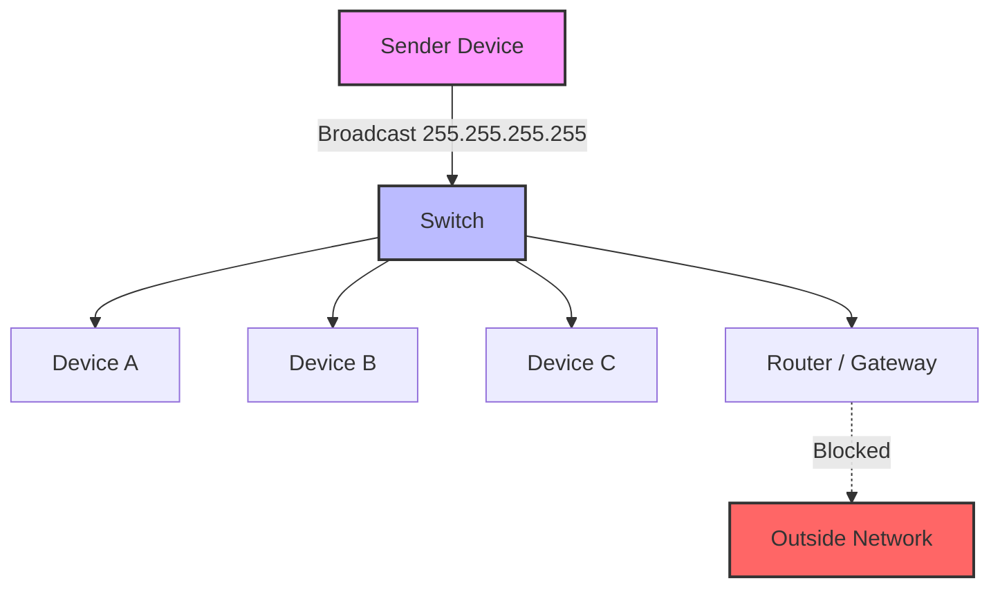

# 2023S_FE-A_32

In the same subnet, which of the following is the devices that will receive the data when the destination address is set to 255.255.255.255?

a) All devices in the same subnet
b) All devices using the same DNS server
c) Only the default gateway of the subnet
d) Only the device sending the data to itself
?
a) All devices in the same subnet

### Explanation

The IP address `255.255.255.255` is the **limited broadcast address**. When a device sends a packet to this address, it is intended to be received by **all devices on the same local network (subnet)**.

Routers typically do not forward packets addressed to `255.255.255.255`, which confines the broadcast to the local subnet.

| Address Type | Example | Description |
|---|---|---|
| Unicast | `192.168.1.10` | Sent from one specific device to another specific device. |
| Limited Broadcast | `255.255.255.255` | Sent to all devices in the **same local subnet**. Not forwarded by routers. |
| Directed Broadcast| `192.168.1.255` | Sent to all devices in a specific subnet. |
| Loopback | `127.0.0.1` | Used by a device to send data to itself. |
