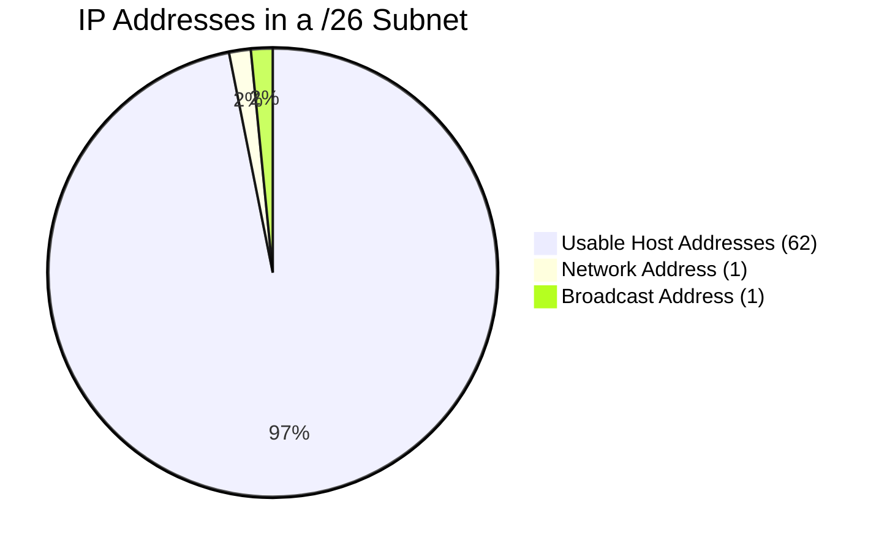

# 2023S_FE-A_33

How many host addresses are there in the network 192.168.10.0/26?

a) 30
b) 62
c) 126
d) 254
?
b) 62

### Explanation

The notation `/26` indicates that the network uses a subnet mask where the first **26 bits** are network bits.
An IPv4 address consists of 32 bits.

1. **Calculate the number of host bits:**
   $$ \text{Host Bits} = \text{Total Bits} - \text{Network Bits} $$
   $$ \text{Host Bits} = 32 - 26 = 6 \text{ bits} $$

2. **Calculate the total number of addresses:**
   With 6 bits, the total number of IP addresses is $2^6 = 64$.

3. **Calculate the number of usable host addresses:**
   In any subnet, two addresses are reserved and cannot be assigned to hosts:
   - The **Network Address** (all host bits are 0).
   - The **Broadcast Address** (all host bits are 1).
   
   $$ \text{Usable Hosts} = 2^{\text{Host Bits}} - 2 $$
   $$ \text{Usable Hosts} = 2^6 - 2 = 64 - 2 = 62 $$

| Parameter | Value |
|---|---|
| IP Address / Subnet | `192.168.10.0 / 26` |
| Subnet Mask | `255.255.255.192` (`11111111.11111111.11111111.11000000`) |
| Network Address | `192.168.10.0` |
| First Host | `192.168.10.1` |
| Last Host | `192.168.10.62` |
| Broadcast Address | `192.168.10.63` |
