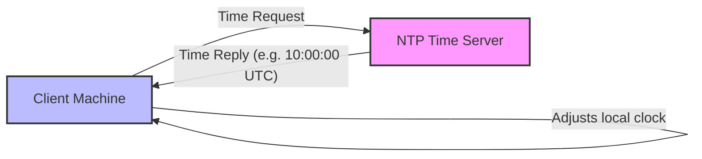

# 2023S_FE-A_34

In a TCP/IP network, which of the following is a protocol used to match the clocks of the server and the client?

a) ARP
b) ICMP
c) NTP
d) RIP
?
c) NTP

### Explanation

**NTP (Network Time Protocol)** is a networking protocol for clock synchronization between computer systems over packet-switched, variable-latency data networks.

| Protocol | Full Name | Function |
|---|---|---|
| a) ARP | Address Resolution Protocol | Maps an IP address to a MAC (physical) address. |
| b) ICMP | Internet Control Message Protocol | Used by network devices to send error messages and operational information (e.g., `ping`). |
| **c) NTP** | **Network Time Protocol** | **Synchronizes the clocks of computers over a network.** |
| d) RIP | Routing Information Protocol | A distance-vector routing protocol used in local and wide area networks. |

