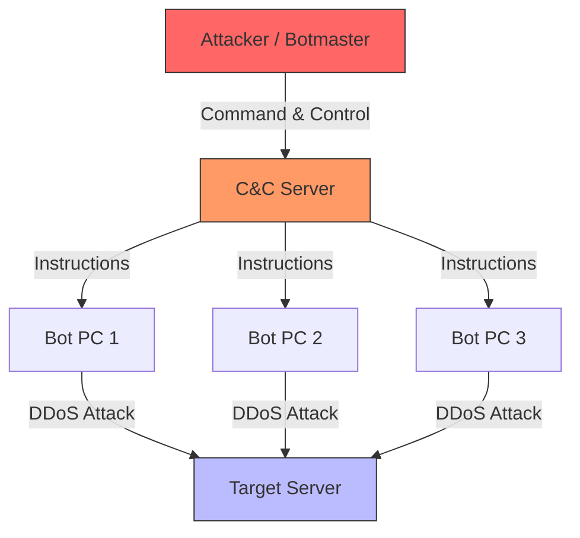

# 2023S_FE-A_36

Which of the following is malware that is activated by attackers to launch attacks on other computers?

a) Bot
b) Rootkit
c) Trojan Horse
d) Worm
?
a) Bot

### Explanation

A **Bot** (short for robot) is a type of malware that allows an attacker to take control over an affected computer. A network of these compromised computers is called a **botnet**. Attackers use botnets to launch coordinated attacks on other computers, such as Distributed Denial of Service (DDoS) attacks, sending spam, or distributing more malware.

| Malware Type | Description |
|---|---|
| **a) Bot** | **A computer compromised and controlled remotely by a cybercriminal to launch attacks or perform automated tasks.** |
| b) Rootkit | Software designed to hide the existence of certain processes or programs from normal methods of detection, giving an attacker persistent, privileged access to a system. |
| c) Trojan Horse | Malware disguised as legitimate software. It relies on tricking the user into executing it. |
| d) Worm | Self-replicating malware that spreads across networks automatically without requiring user interaction. |

