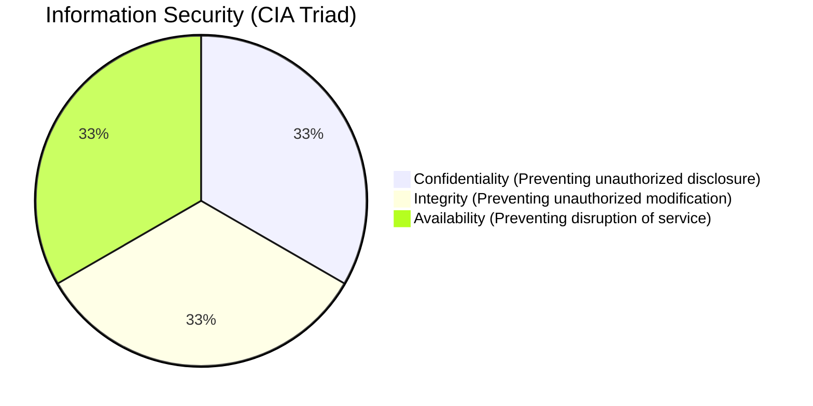

# 2023S_FE-A_37

Which of the following is considered a violation of confidentiality?

a) Denial of services to a website handling confidential information by generating fake heavy traffic in the network
b) Destruction of server hardware storing personal information caused by high voltage due to failure of voltage stabilizer
c) Disturbing communication by destroying ciphertext of confidential information
d) Tricking a user into providing personal information to a fake website
?
d) Tricking a user into providing personal information to a fake website

### Explanation

The CIA triad is the core model of Information Security:
1. **Confidentiality:** Ensuring that information is only accessible to those authorized to have access.
2. **Integrity:** Safeguarding the accuracy and completeness of information and processing methods.
3. **Availability:** Ensuring that authorized users have access to information and associated assets when required.

| Option | Description | Which CIA aspect is violated? |
|---|---|---|
| a | DoS attack by generating heavy traffic | **Availability** (legitimate users cannot access the service) |
| b | Hardware destruction | **Availability** (data and service are lost) |
| c | Destroying ciphertext | **Availability** and **Integrity** (data is lost or corrupted) |
| **d** | **Phishing (Tricking user for info)** | **Confidentiality** (unauthorized access to personal info) |

