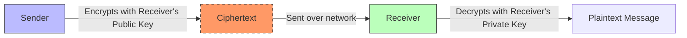

# 2023S_FE-A_38

Which of the following is an appropriate description of “asymmetric encryption,” used for encrypting and decrypting messages for secure communication?

a) A ciphertext message is shorter than its original plaintext message.
b) A message receiver’s public key is used to encrypt the message and his/her private key is used to decrypt the message.
c) A message sender’s private key is open to everyone and is used to encrypt the message, and each message receiver’s public key is used to decrypt the message.
d) A secret key needs to be shared among those who need to receive the message.
?
b) A message receiver’s public key is used to encrypt the message and his/her private key is used to decrypt the message.

### Explanation

**Asymmetric encryption** (also known as Public Key Cryptography) uses two mathematically related keys:
1. **Public Key:** Shared openly and used to **encrypt** messages for the owner of the keypair.
2. **Private Key:** Kept secret by the owner and used to **decrypt** messages that were encrypted with the corresponding Public Key.

| Option | Analysis |
|---|---|
| a | Incorrect. Ciphertexts are generally equal in length or slightly longer than the plaintext depending on the padding. |
| **b** | **Correct.** To send a secure message, the sender uses the receiver's **public key** to encrypt it. Only the receiver's **private key** can decrypt it. |
| c | Incorrect. Private keys must *never* be open to everyone. |
| d | Incorrect. This describes **symmetric encryption**, where a single shared secret key is used for both encryption and decryption. |

