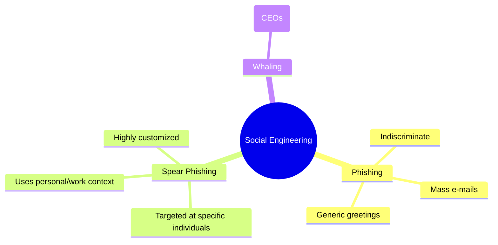

# 2023S_FE-A_39

Which of the following is a method of social engineering used in a targeted e-mail attack?

a) “Unsolicited advertising” is shown in the subject.
b) Content that appears to be related to the work of the recipient is shown in the subject or body text.
c) In order to make the recipients access a bogus website, the sender pretends to be a financial institution and sends e-mails indiscriminately.
d) In order to make the recipients transfer a fee that they do not need to pay, the sender pretends to be a collection agency and sends e-mails indiscriminately.
?
b) Content that appears to be related to the work of the recipient is shown in the subject or body text.

### Explanation

A **targeted e-mail attack** (specifically known as **Spear Phishing**) is highly customized. The attacker researches the target (e.g., finding out their role, recent projects, or colleagues) and crafts an email that appears highly relevant and legitimate to that specific individual or organization. This differs from standard phishing, which casts a wide net.

| Option | Attack Type | Explanation |
|---|---|---|
| a | Spam | Unsolicited advertising, usually sent in bulk. |
| **b** | **Targeted Email Attack (Spear Phishing)** | **Highly tailored to the specific recipient to increase the likelihood of success.** |
| c | Phishing | Sent **indiscriminately** in bulk, hoping someone falls for it. |
| d | Phishing / Scam | Also sent **indiscriminately**, lacking the specific targeting aspect. |

