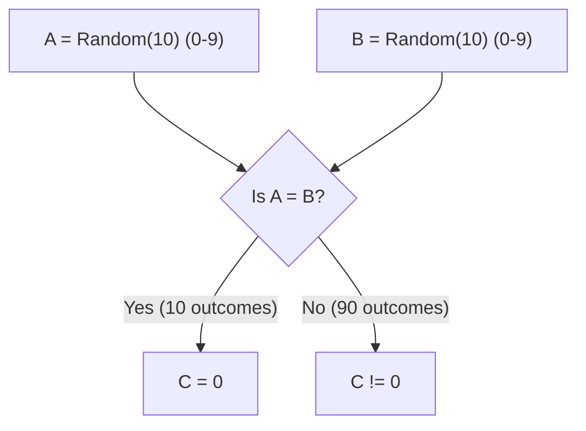

# 2023S_FE-A_4

Random(n) is a function that returns an integer of 0 or more and less than n with a uniform probability. When the series of procedures below is run on the integer type variables A, B, and C, what is the probability that the value of C will be 0? 

A = Random(10)
B = Random(10)
C = A - B

a) 1/100
b) 1/20
c) 1/10
d) 1/5
?
c) 1/10

### Explanation
The function `Random(10)` returns an integer in the range `0` to `9` uniformly. This means there are 10 possible values for $A$ and 10 possible values for $B$.

**Total Outcomes:**
Since $A$ and $B$ are independent, the total number of possible pairs $(A, B)$ is:
$10 \times 10 = 100$

**Favorable Outcomes:**
We want $C = 0$. Since $C = A - B$, this occurs if and only if $A = B$.
The pairs where $A = B$ are:
$(0,0), (1,1), (2,2), ..., (9,9)$

| Variable A | Variable B | Condition (A = B) | Count |
| :---: | :---: | :--- | :---: |
| 0 to 9 (10 values) | 0 to 9 (10 values) | $A$ must equal $B$ | 10 pairs |

**Probability Calculation:**
$P(C = 0) = \frac{\text{Number of favorable outcomes}}{\text{Total possible outcomes}} = \frac{10}{100} = \frac{1}{10}$

