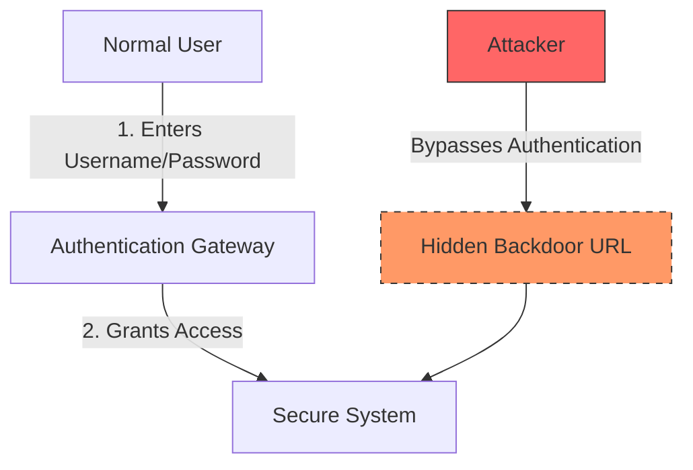

# 2023S_FE-A_40

In information security, which of the following is a back door?

a) A LAN port that is incorporated into a switch in order to obtain network communication packets and inspect details of the communication
b) A tool that searches for an open TCP port on a server on the Internet, and identifies running services
c) A URL that enables access to a website without going through the official procedures such as password authentication that are normally required for access
d) An attack that causes a program to crash by entering a string with a length that exceeds the size of an area of memory acquired by the program, causing an overflow
?
c) A URL that enables access to a website without going through the official procedures such as password authentication that are normally required for access

### Explanation

A **Backdoor** refers to any method by which authorized and unauthorized users are able to get around normal security measures (like authentication) and gain high-level user access on a computer system, network, or software application.

| Option | Terminology | Description |
|---|---|---|
| a | Port Mirroring / Sniffing | Using a mirrored port (SPAN) on a switch to capture and analyze network traffic. |
| b | Port Scanner | A tool (like Nmap) used to scan for open ports and services on a target machine. |
| **c** | **Backdoor** | **A hidden entry point (like an unauthenticated URL) left by a developer or attacker to bypass normal security controls.** |
| d | Buffer Overflow | An attack involving sending more data than a buffer can handle, causing it to overwrite adjacent memory. |

