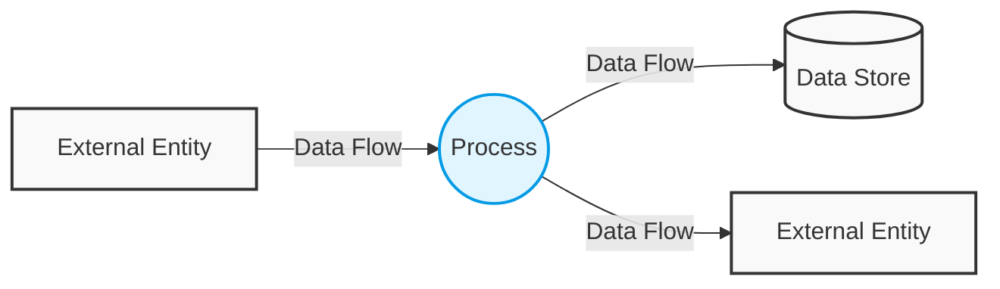

# 2023S_FE-A_46

![[2023S_FE-A_Q46_full.png]]
?
d) 

### Explanation
A Data Flow Diagram (DFD) visually represents the flow of data through an information system. In structured analysis, it uses specific symbols:

| Symbol (Yourdon/DeMarco) | Meaning | Description |
| :---: | :---: | :--- |
| **Circle / Bubble ($\bigcirc$)** | **Process** | Represents an activity or function that transforms data (e.g., calculations, sorting, formatting). This is the symbol in question. |
| **Arrow ($\rightarrow$)** | **Data Flow** | Represents the movement of data between processes, stores, and external entities. |
| **Open Rectangle ($=$ or parallel lines)** | **Data Store** | Represents data at rest, such as a file or database where data is stored for future use. |
| **Square / Rectangle ($\square$)** | **External Entity** | Represents a source or destination of data outside the system's boundaries (e.g., a user, another system). |

