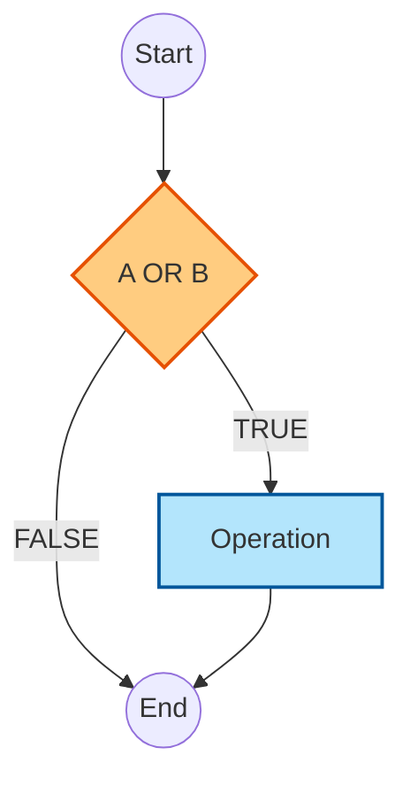

# 2023S_FE-A_49

![[2023S_FE-A_Q49_full.png]]
?
c) 

### Explanation
**Decision Condition Coverage (Branch Coverage)** requires that every possible outcome of all decision branches (i.e., `TRUE` and `FALSE`) in the program is executed at least once.

In the flowchart, there is a single decision block: `A OR B`.
For Branch Coverage, we need test cases that make the decision `A OR B` evaluate to `TRUE` and to `FALSE`.

Let's evaluate the Boolean expression `A OR B`:
| A | B | `A OR B` | Branch Taken |
| :---: | :---: | :---: | :--- |
| False | False | **False** | FALSE |
| False | True | **True** | TRUE |
| True | False | **True** | TRUE |
| True | True | **True** | TRUE |

To achieve branch coverage, we only need a minimum of two test cases:
1.  One case where `A OR B` is **False** (This is only possible when both A and B are `False`).
2.  One case where `A OR B` is **True** (This can be any of the other three combinations, such as A=`True` and B=`True`).

Looking at the options:
*   **a)** {A=False, B=True}: Covers only TRUE branch. (Incomplete)
*   **b)** {A=False, B=True} $\rightarrow$ TRUE, {A=True, B=False} $\rightarrow$ TRUE. Covers only TRUE branch. (Incomplete)
*   **c)** {A=False, B=False} $\rightarrow$ **FALSE**, {A=True, B=True} $\rightarrow$ **TRUE**. **Covers both TRUE and FALSE branches.**
*   **d)** Exhaustive testing (Condition coverage / Multiple condition coverage). While it covers the branches, it has more tests than strictly necessary for simple branch coverage, but since this is a multiple choice question asking for the *appropriate* set to satisfy the coverage criteria, the set must cover both outcomes efficiently. Option c) achieves decision/branch coverage correctly with minimal test cases.

Therefore, option c) is the correct answer.

