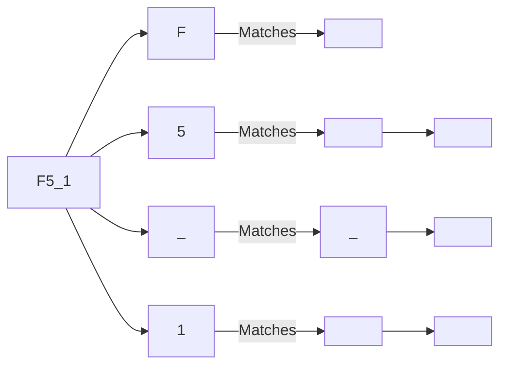

# 2023S_FE-A_5

Which of the following matches the <variable-name> defined below in BNF? 

<number> :: = 0 | 1 | 2 | 3 | 4 | 5 | 6 | 7 | 8 | 9 
<letter> :: = A | B | C | D | E | F
<letter-and-number> :: = <letter> | <number> | _ 
<variable-name> :: = <letter> | <variable-name><letter-and-number> 

a) _B39 
b) 246 
c) 3E5 
d) F5_1 
?
d) F5_1

### Explanation
Let's analyze the BNF (Backus-Naur Form) rules provided:

1. `<number>` can be any single digit from 0 to 9.
2. `<letter>` can be any single uppercase letter from A to F.
3. `<letter-and-number>` can be a `<letter>`, a `<number>`, or an underscore `_`.
4. `<variable-name>` can be just a `<letter>`, OR it can be an existing `<variable-name>` followed by a `<letter-and-number>`.

This recursive definition for `<variable-name>` means that:
*   A variable name **must start** with a `<letter>` (A-F).
*   Subsequent characters can be `<letter>`, `<number>`, or `_`.

Let's evaluate the choices:

| Choice | Starts With | Follows Rule? | Reason |
| :--- | :--- | :--- | :--- |
| **a) _B39** | `_` (Underscore) | ❌ False | Must start with A-F, not an underscore. |
| **b) 246** | `2` (Number) | ❌ False | Must start with A-F, not a number. |
| **c) 3E5** | `3` (Number) | ❌ False | Must start with A-F, not a number. |
| **d) F5_1** | `F` (Letter) | ✅ True | Starts with `F` (Letter), followed by `5` (Number), `_`, and `1` (Number). All valid `<letter-and-number>` characters. |

