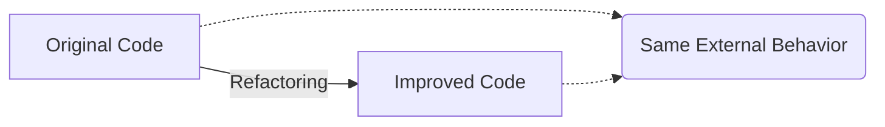

# 2023S_FE-A_51

As for software development activities, which of the following is refactoring?

a) In order to improve the maintainability of a program, its internal structure is modified without any change to the external specifications.
b) In order to improve the quality of a program, two programmers cooperate to perform the coding of a single program.
c) In order to obtain feedback from users, the prototype of a program to be provided is created at an early stage.
d) In order to promptly develop a program to be operated, test cases are set in advance and the program is then coded.
?
a) In order to improve the maintainability of a program, its internal structure is modified without any change to the external specifications.

### Explanation

**Refactoring** is the process of restructuring existing computer code—altering the internal structure—without changing its external behavior or specifications.

| Option | Concept | Description |
| :--- | :--- | :--- |
| **a** | **Refactoring** | Improving code maintainability, readability, and reducing complexity without changing external behavior. |
| **b** | **Pair Programming** | An Agile software development technique in which two programmers work together at one workstation. |
| **c** | **Prototyping** | Building an early sample or model of a product to test a concept or process and gather user feedback. |
| **d** | **Test-Driven Development (TDD)** | A software development process where test cases are written before the actual code is developed. |

