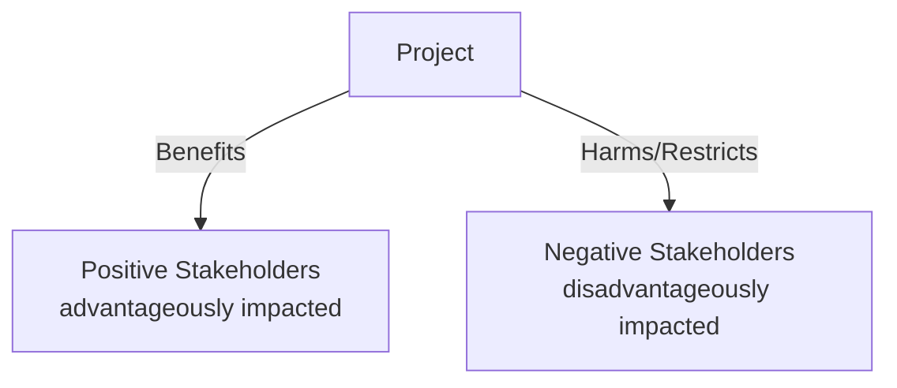

# 2023S_FE-A_52

Which of the following is an appropriate description of the stakeholders involved in a project?

a) Some stakeholders receive the project result advantageously and others disadvantageously.
b) The stakeholders are individually identified people, such as project managers.
c) The stakeholders belong within the organization and do not exist outside of it.
d) The stakeholders participate directly in the project; they are not limited to indirect involvement.
?
a) Some stakeholders receive the project result advantageously and others disadvantageously.

### Explanation

A **stakeholder** is an individual, group, or organization that may affect, be affected by, or perceive itself to be affected by a decision, activity, or outcome of a project. 

Because different stakeholders have different interests, they can be either positively or negatively impacted by the project's execution or completion. Not all stakeholders benefit; some may be disadvantaged by the project's outcome.

| Statement | Why it is incorrect |
| :--- | :--- |
| **b** | Stakeholders are not limited to individuals like project managers; they can also be entire groups, communities, or organizations. |
| **c** | Stakeholders can be external to the organization (e.g., customers, suppliers, government agencies, the public). |
| **d** | Stakeholders can participate directly, but they can also be involved indirectly (e.g., a local community affected by a construction project). |

