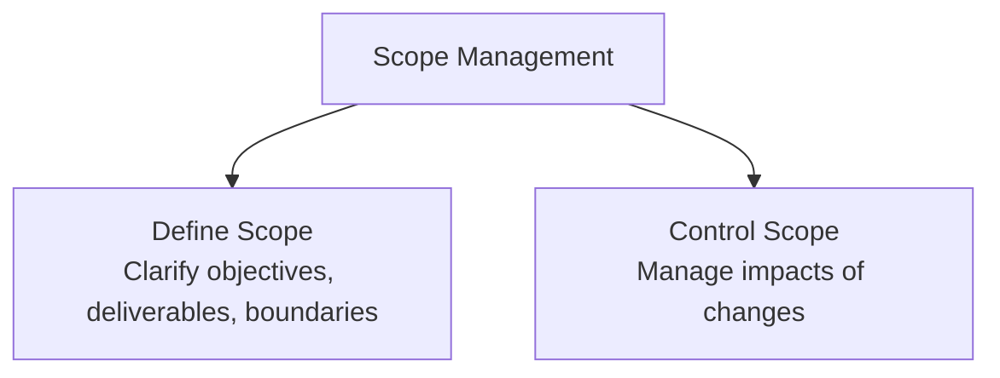

# 2023S_FE-A_53

In project management, which of the following is the subject group that includes processes having Purpose 1 and those having Purpose 2?

[Purposes]
Purpose 1: To clarify the objectives, deliverables, requirements, and boundaries of the project
Purpose 2: To maximize the positive impacts to the project and minimize the negative impacts, both of which occur as a result of changes in the objectives and deliverables of the project

a) Communication
b) Procurement
c) Risk
d) Scope
?
d) Scope

### Explanation

**Project Scope Management** involves processes required to ensure that the project includes all the work required, and only the work required, to complete the project successfully. 

- **Purpose 1** corresponds to the **Collect Requirements** and **Define Scope** processes, which aim to clarify the objectives, deliverables, requirements, and boundaries of the project.
- **Purpose 2** corresponds to the **Control Scope** process. Controlling scope manages changes to the scope baseline, attempting to maximize positive impacts and minimize negative impacts that result from changes in the project's objectives and deliverables.

