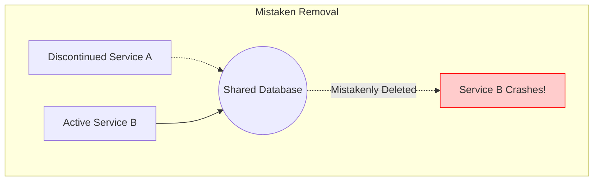

# 2023S_FE-A_56

When an IT service is discontinued, it is important to comprehensively identify the assets that were used and appropriately remove or free surplus assets. Which of the following is an event that may occur due to mistaken removal of assets that should remain, but does not occur because of the removal of assets that should be removed?

a) Occurrence of incidents involving other IT services that share assets with the discontinued IT service
b) Overpaying software or hardware maintenance charges
c) Wasting money on software licenses
d) Wasting space that becomes unused on magnetic disks
?
a) Occurrence of incidents involving other IT services that share assets with the discontinued IT service

### Explanation

When an IT service is discontinued, its corresponding IT assets (servers, licenses, databases, network configurations) must be retired or removed. However, a common risk is that some of these assets are **shared** with other active IT services.

If an asset is mistakenly removed when it **should remain** (because another service relies on it), the active services will suddenly fail, causing incidents and outages.

| Option | Event | Cause |
| :--- | :--- | :--- |
| **a** | **Incidents in other active IT services** | Caused by the **mistaken removal** of shared assets that should have remained active. |
| **b** | **Overpaying maintenance charges** | Caused by the **failure to remove** assets that should be removed. |
| **c** | **Wasting money on licenses** | Caused by the **failure to remove/cancel** licenses that should be removed. |
| **d** | **Wasting unused magnetic disk space** | Caused by the **failure to free/remove** storage that should be removed. |

