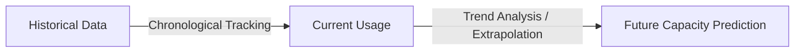

# 2023S_FE-A_57

As for activities in capacity management to estimate a service’s capacity, capability, and performance, which of the following is trend analysis?

a) As the first phase of modeling, creating a model that accurately reflects the current performance
b) Generating simulated transactions and predicting the response time and throughput of a service
c) Understanding the chronological usage of a specific resource and predicting usage changes in the future
d) Using mathematical techniques, such as queueing theory, and predicting the response time and throughput of a service
?
c) Understanding the chronological usage of a specific resource and predicting usage changes in the future

### Explanation

In ITIL Capacity Management, **trend analysis** involves studying historical data over a chronological period to identify patterns, evaluate growth or decline, and predict future resource usage and capacity requirements.

| Option | Capacity Management Technique | Description |
| :--- | :--- | :--- |
| **a** | **Baseline Modeling** | Creating an initial model that accurately reflects the current state and performance of the system to serve as a reference point for future comparisons. |
| **b** | **Simulation Modeling** | Using simulated transactions or load testing to mimic real-world behavior and evaluate how a service will perform under various conditions. |
| **c** | **Trend Analysis** | Analyzing historical (chronological) data to predict future usage changes. |
| **d** | **Analytical Modeling** | Using mathematical models, such as queuing theory, to calculate and predict response times and throughput without actually running simulated transactions. |

