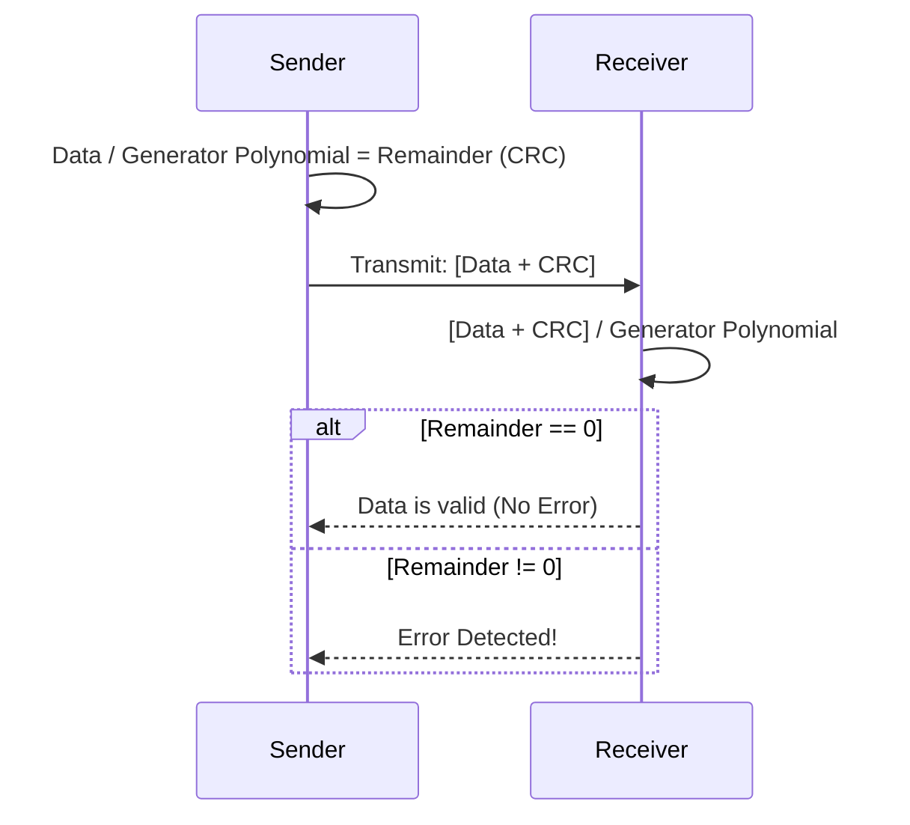

# 2023S_FE-A_6

Which of the following is an error detection method where, on the sender side, the data sent accompanies a remainder of the data bit sequence divided by a specific generator polynomial, while on the receiver side, error detection is performed by checking if the received bit sequence is divisible by the same polynomial? 

a) CRC 
b) Hamming code 
c) Horizontal parity check 
d) Vertical parity check 
?
a) CRC

### Explanation
The method described in the question defines the **Cyclic Redundancy Check (CRC)**.

CRC is an error-detecting code commonly used in digital networks and storage devices to detect accidental changes to raw data.

| Error Detection Method | Description |
| :--- | :--- |
| **a) CRC** | Uses polynomial division. The sender appends a remainder (FCS) so that the entire transmitted sequence is divisible by a predetermined generator polynomial. The receiver performs the same division; if the remainder is 0, there is no error. |
| **b) Hamming code** | An error-correcting code capable of detecting up to two simultaneous bit errors and correcting single-bit errors using multiple parity bits. |
| **c) Horizontal parity check** | Parity bits are calculated along rows in a block of data. |
| **d) Vertical parity check** | Parity bits are calculated along columns in a block of data. |

