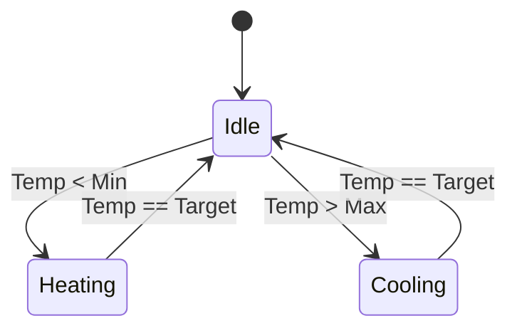

# 2023S_FE-A_62

Which of the following is a system where the use of a state transition diagram is appropriate when the system is designed?

a) Electricity charge calculation system that calculates charges based on the amount of power usage from power meter readings.
b) Greenhouse control system that keeps the environment in a greenhouse optimal based on the data of an installed sensor.
c) Inventory control system that performs the collection and aggregation of inventory assets at the end of every month and at the time of settlement.
d) System that measures the operational status of the system resources and creates a report.
?
b) Greenhouse control system that keeps the environment in a greenhouse optimal based on the data of an installed sensor.

### Explanation

A **State Transition Diagram** (or state machine diagram) is used to model the dynamic behavior of systems that exist in different discrete states and transition between them in response to specific events or conditions. It is especially useful for **event-driven control systems**.

* **a) Electricity calculation:** This is primarily a batch processing or mathematical calculation system. A data flow diagram or flowchart is more appropriate.
* **b) Greenhouse control:** The system operates by changing states (e.g., *Heating*, *Cooling*, *Idle*) based on sensor inputs (events like *temperature < threshold*). A state transition diagram perfectly maps this behavior.
* **c) Inventory control:** Similar to (a), this is a batch processing system focusing on data aggregation.
* **d) Resource measurement:** This is a continuous monitoring and reporting tool, rather than a system switching between distinct operational states.

