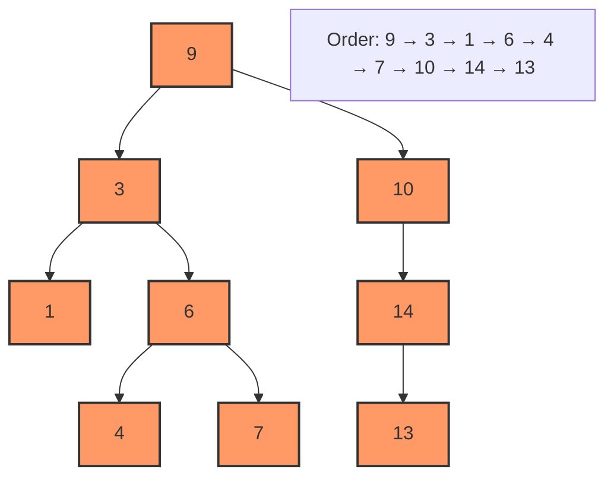

# 2023S_FE-A_7

![[2023S_FE-A_Q7_full.png]]
?
c) 9, 3, 1, 6, 4, 7, 10, 14, 13

### Explanation
A **pre-order traversal** of a binary tree visits the nodes in the following order:
1.  **Visit the Root**
2.  **Traverse the Left Subtree** (in pre-order)
3.  **Traverse the Right Subtree** (in pre-order)

Let's trace the pre-order traversal for the given tree step-by-step:

| Step | Current Node | Action | Traversal Output So Far |
| :---: | :---: | :--- | :--- |
| 1 | 9 | Visit Root (9). Traverse left subtree. | `9` |
| 2 | 3 | Visit Node (3). Traverse left subtree. | `9, 3` |
| 3 | 1 | Visit Node (1). No children. Return to 3, then traverse right. | `9, 3, 1` |
| 4 | 6 | Visit Node (6). Traverse left subtree. | `9, 3, 1, 6` |
| 5 | 4 | Visit Node (4). No children. Return to 6, then traverse right. | `9, 3, 1, 6, 4` |
| 6 | 7 | Visit Node (7). No children. Left subtree of 9 is done. Traverse right subtree of 9. | `9, 3, 1, 6, 4, 7` |
| 7 | 10 | Visit Node (10). Traverse right subtree (no left child). | `9, 3, 1, 6, 4, 7, 10` |
| 8 | 14 | Visit Node (14). Traverse left subtree. | `9, 3, 1, 6, 4, 7, 10, 14` |
| 9 | 13 | Visit Node (13). No children. Traversal complete. | `9, 3, 1, 6, 4, 7, 10, 14, 13` |

