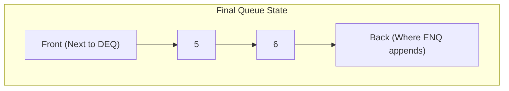

# 2023S_FE-A_8

The operations for a queue are defined as below. 

ENQ n: This operation appends data n to the queue. 
DEQ: This operation removes data from the queue. 

On an empty queue, the operations ENQ 1, ENQ 2, ENQ 3, DEQ, ENQ 4, ENQ 5, DEQ, ENQ 6, DEQ, DEQ are performed. After that, when DEQ is performed, what is the value that is removed? 

a) 1 
b) 2 
c) 5 
d) 6 
?
c) 5

### Explanation
A **Queue** is a First-In-First-Out (FIFO) data structure. Elements are added to the back (enqueue) and removed from the front (dequeue).

Let's trace the state of the queue after each operation:

| Operation | Effect | Queue State (Front to Back) | Popped Value |
| :--- | :--- | :--- | :---: |
| `ENQ 1` | Add 1 | `[1]` | - |
| `ENQ 2` | Add 2 | `[1, 2]` | - |
| `ENQ 3` | Add 3 | `[1, 2, 3]` | - |
| `DEQ` | Remove from front | `[2, 3]` | **1** |
| `ENQ 4` | Add 4 | `[2, 3, 4]` | - |
| `ENQ 5` | Add 5 | `[2, 3, 4, 5]` | - |
| `DEQ` | Remove from front | `[3, 4, 5]` | **2** |
| `ENQ 6` | Add 6 | `[3, 4, 5, 6]` | - |
| `DEQ` | Remove from front | `[4, 5, 6]` | **3** |
| `DEQ` | Remove from front | `[5, 6]` | **4** |

After all these operations, the state of the queue is `[5, 6]`.

"After that, when DEQ is performed, what is the value that is removed?"
The next element at the front of the queue is **5**.

