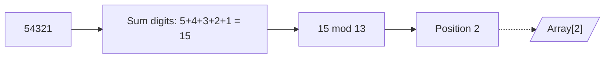

# 2023S_FE-A_9

A five-digit number a1a2a3a4a5 needs to be stored in an array by means of hashing. When the hash function is mod (a1+a2+a3+a4+a5, 13) and the number is stored in the array element at the position corresponding to the calculated hash value, which of the following is the position where 54321 is stored in the array? Here, the value of mod (x, 13) is the remainder after dividing x by 13.

a) 1 
b) 2 
c) 7 
d) 11 
?
b) 2

### Explanation
We are given a 5-digit number `54321` and a hash function defined as:
$H(x) = (a_1 + a_2 + a_3 + a_4 + a_5) \pmod{13}$

**Step 1: Identify the digits**
For the number `54321`, the digits are:
*   $a_1 = 5$
*   $a_2 = 4$
*   $a_3 = 3$
*   $a_4 = 2$
*   $a_5 = 1$

**Step 2: Calculate the sum of the digits**
$Sum = 5 + 4 + 3 + 2 + 1 = 15$

**Step 3: Apply the modulo operation**
Calculate $15 \pmod{13}$.
$15 = (13 \times 1) + 2$
The remainder is **2**.

Thus, the number 54321 will be stored at position 2 in the array.

