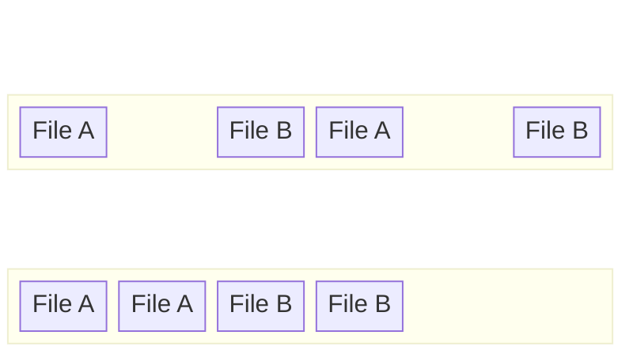

# 2024A_FE-A_10

Which of the following is the appropriate purpose of defragmentation of hard disks? 

a) To access disk files faster and more efficiently 
b) To clean up temporary and junk files 
c) To delete IBG (interblock gap) and increase capacity 
d) To protect disk drives from physical failures 
?
a) To access disk files faster and more efficiently

### Explanation
**Defragmentation** is a process that reduces the degree of fragmentation on a hard disk drive (HDD).

When files are saved, modified, or deleted over time, parts of the files can become scattered across non-contiguous sectors on the disk (fragmentation). When the operating system needs to read a fragmented file, the read/write head of the HDD must move to multiple different physical locations, which increases the seek time and slows down file access.

The defragmentation utility physically organizes the contents of the disk, putting the scattered pieces of each file into contiguous (adjacent) blocks. 

* **a) To access disk files faster and more efficiently:** Correct. By storing file fragments consecutively, the read/write head doesn't have to jump around, minimizing seek time and rotational latency, which speeds up file access.
* **b) To clean up temporary and junk files:** This is the function of a "Disk Cleanup" utility, not defragmentation.
* **c) To delete IBG (interblock gap) and increase capacity:** Interblock gaps are physical spaces used on magnetic tapes to separate blocks of data. They cannot be "deleted" by defragmentation, and defragmentation does not increase the total capacity of a disk; it only reorganizes existing data.
* **d) To protect disk drives from physical failures:** Defragmentation does not prevent physical hardware failures. It is a logical maintenance process.

