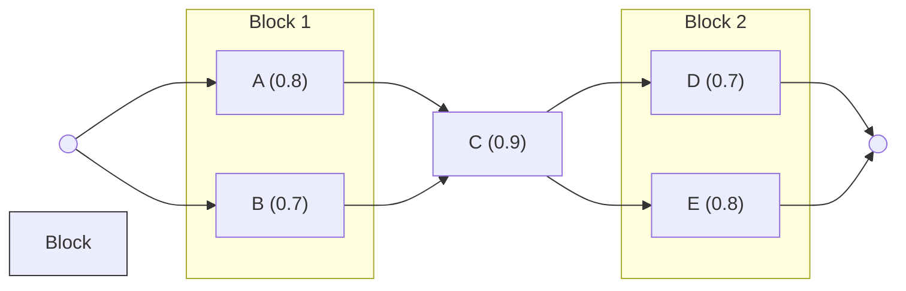

# 2024A_FE-A_12

![[2024A_FE-A_Q12_full.png]]

?
d) 0.795

### Explanation

To solve this, we must determine the overall availability of the combined system based on standard reliability block diagrams (RBD).

#### 1. Availability of Parallel Connections
When components are connected in **parallel**, the system is operational as long as at least one component is working. 
The formula for two parallel components $X$ and $Y$ with availabilities $R_X$ and $R_Y$ is:
$$R_{parallel} = 1 - (1 - R_X)(1 - R_Y)$$

Let's calculate the availability of the two parallel blocks:
**Block 1 (A and B):**
- $R_A = 0.8$
- $R_B = 0.7$
$$R_{AB} = 1 - (1 - 0.8)(1 - 0.7) = 1 - (0.2)(0.3) = 1 - 0.06 = 0.94$$

**Block 2 (D and E):**
- $R_D = 0.7$
- $R_E = 0.8$
$$R_{DE} = 1 - (1 - 0.7)(1 - 0.8) = 1 - (0.3)(0.2) = 1 - 0.06 = 0.94$$

#### 2. Availability of Series Connections
When components are connected in **series**, all components must function for the system to work. 
The formula for series components $X$, $Y$, and $Z$ is:
$$R_{series} = R_X \times R_Y \times R_Z$$

The system can be simplified to a series connection of **Block 1**, **Device C**, and **Block 2**.
- $R_{AB} = 0.94$
- $R_C = 0.9$
- $R_{DE} = 0.94$

**Total System Availability ($R_{total}$):**
$$R_{total} = R_{AB} \times R_C \times R_{DE}$$
$$R_{total} = 0.94 \times 0.9 \times 0.94$$
$$R_{total} = 0.846 \times 0.94$$
$$R_{total} = 0.79524$$

Rounding to three decimal places, we get **0.795**. Thus, the correct answer is **d) 0.795**.

