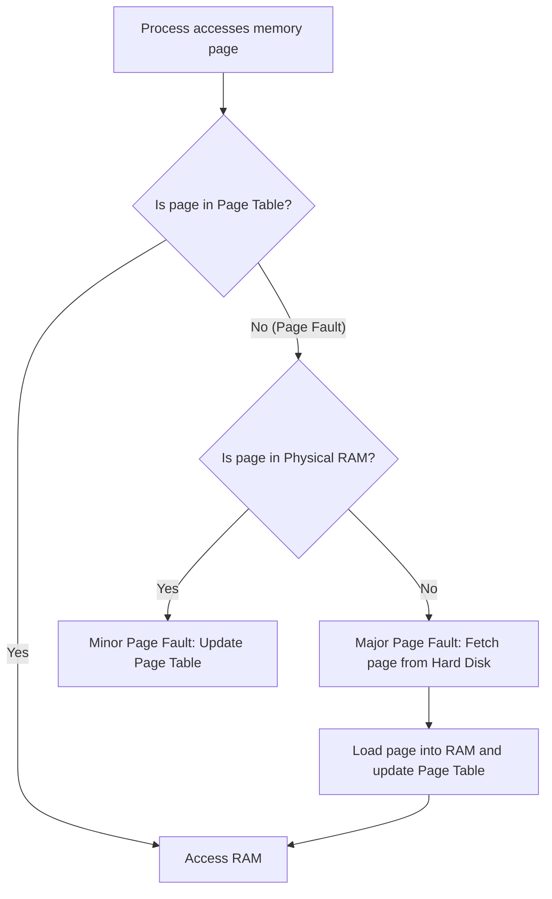

# 2024A_FE-A_13

Q13. There are minor and major page faults in an Operating System (OS). Which of the following is an appropriate action of the OS when a major page fault occurs?

a) Asking the user to input the instruction corresponding to the page
b) Looking for a page in CPU cache
c) Looking for a page in virtual memory on the hard disk
d) Looking for the missed block corresponding to the page on the physical memory

?
c) Looking for a page in virtual memory on the hard disk

### Explanation

In a **virtual memory** system, a **page fault** occurs when a running program tries to access a memory page that is not currently mapped in its page table or not loaded into Physical RAM.

There are two primary types of page faults:

1. **Minor Page Fault (Soft Page Fault):** The requested page is actually loaded in physical memory (RAM) but has not been mapped to the current process's page table yet (e.g., it might be shared with another process or recently removed from the working set but not yet overwritten). It is resolved quickly without disk I/O.
2. **Major Page Fault (Hard Page Fault):** The requested page is **not** currently present in physical memory. It has been swapped out (paged out) or has never been loaded. The OS must perform disk I/O to fetch the page from the **virtual memory on the hard disk (swap space/page file)** into physical memory.

Therefore, the correct action for a **major page fault** is to look for the missing page in the virtual memory stored on the hard disk.
