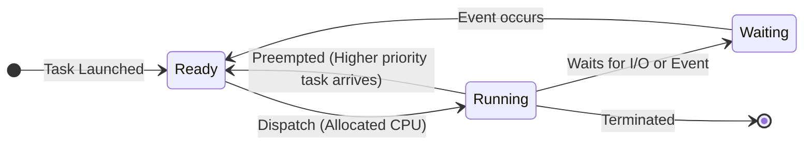

# 2024A_FE-A_14

Q14. A real-time OS that performs preemptive priority scheduling for tasks A and B with A having a higher priority than B. Which of the following is the action that the OS takes?

a) When A is launched during the execution of B, B is put into a ready state and A is executed.
b) When A is launched during the execution of B, B is put into a waiting state and A is executed.
c) When B is launched during the execution of A, A is put into a ready state and B is executed.
d) When B is launched during the execution of A, A is put into a waiting state and B is executed.

?
a) When A is launched during the execution of B, B is put into a ready state and A is executed.

### Explanation

In a **preemptive priority scheduling** algorithm, the CPU is always allocated to the highest priority process that is available to run. 

1. **Preemption**: If a lower-priority task (Task B) is currently executing and a higher-priority task (Task A) is launched (becomes ready), the OS will immediately interrupt (preempt) Task B. 
2. **State Transition**: 
   - Task A is given the CPU and goes into the **Running** state.
   - The interrupted Task B is moved back to the **Ready** state, *not* the Waiting state. The **Waiting** (or Blocked) state is strictly reserved for processes that are waiting for an event to occur (e.g., I/O operations to complete, waiting on a semaphore), not for processes waiting for CPU time. 

| State | Description |
| :--- | :--- |
| **Running** | The task is actively executing on the CPU. |
| **Ready** | The task is prepared to execute but is waiting for CPU time to be allocated. |
| **Waiting (Blocked)** | The task cannot execute because it is waiting for some external event (like I/O). |

Therefore, Task B is preempted and put into a **ready state**, allowing Task A to execute.
