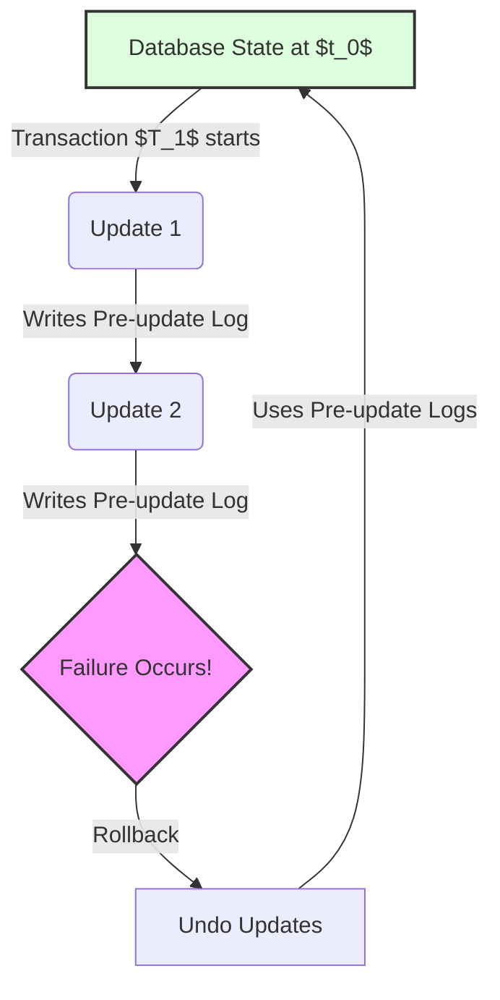

# 2024A_FE-A_21

If a transaction processing program ends abnormally while updating the database, the database is recovered by a rollback process. In these circumstances, which of the following is the information that is used?

a) Post-update information of log files
b) Pre-update information of log files
c) The latest backup file information
d) The latest snapshot information
?
b) Pre-update information of log files

### Explanation

When a transaction terminates abnormally before it commits (e.g., due to a program error, system crash, or deadlock), the database must be restored to its consistent state prior to the transaction. This recovery operation is called a **rollback**.

To perform a rollback, the Database Management System (DBMS) undoes any changes made by the incomplete transaction. It achieves this by reading the **before-images** (pre-update information) from the transaction log (also known as the journal).

#### The Rollback Process

| Step | Action | Description |
| :--- | :--- | :--- |
| 1 | **Identify Aborted Transaction** | The system identifies that a transaction $T$ has failed or aborted. |
| 2 | **Read Log Backwards** | The DBMS reads the transaction log backward from the point of failure. |
| 3 | **Apply Pre-Update Values** | For each modification made by $T$, the system restores the data item using its **pre-update** value stored in the log. |
| 4 | **Mark as Rolled Back** | The transaction is marked as rolled back in the log, restoring the database consistency. |

#### Visualizing Rollback vs. Rollforward

- **Post-update information** is used for **rollforward** (redo) operations, which are necessary when a system crashes after a transaction commits but before changes are written to the disk.
- **Backup files and snapshots** are used for restoring the database in case of media failure (e.g., disk crash), not for typical transaction aborts.
