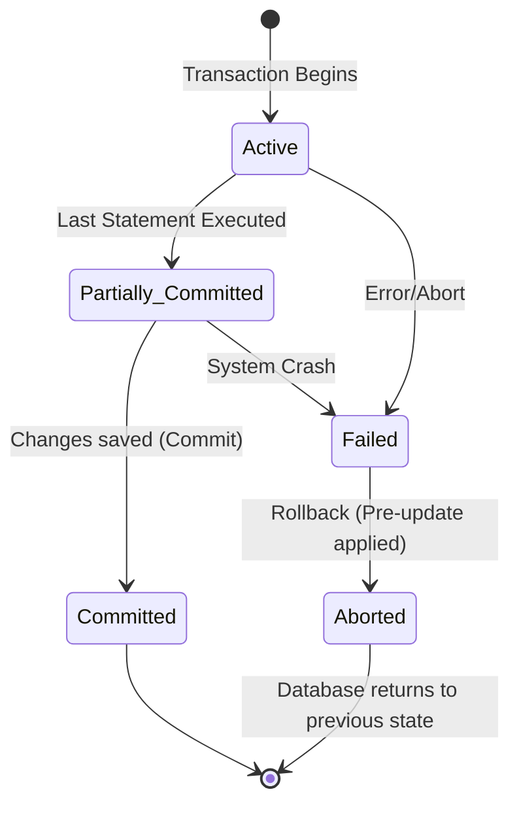

# 2024A_FE-A_22

Which of the following is a property on a database that guarantees a result where a transaction either fully completes update processing or is revoked as if no processing took place at all?

a) Atomicity
b) Consistency
c) Durability
d) Isolation
?
a) Atomicity

### Explanation

Database transactions must adhere to the **ACID** properties to guarantee data validity despite errors, power failures, or other mishaps. The property described in the question—where a transaction is treated as a single, indivisible logical unit of work (either all of it executes or none of it does)—is **Atomicity**.

#### ACID Properties Breakdown

| Property | Description | Meaning in Practice |
| :--- | :--- | :--- |
| **A**tomicity | "All or nothing" principle. | If a transaction fails midway, all previous steps are undone (rolled back). |
| **C**onsistency | Validity of data. | A transaction transforms the database from one valid state to another valid state, maintaining all constraints. |
| **I**solation | Separation of concurrent transactions. | Concurrent transactions do not interfere with each other; their intermediate states are invisible to one another. |
| **D**urability | Permanence of committed data. | Once a transaction commits, its changes survive subsequent system crashes. |

#### Atomicity State Machine

By ensuring **Atomicity**, the database is protected from partial updates that could leave it in an inconsistent state (e.g., deducting money from Account A but crashing before crediting Account B).
