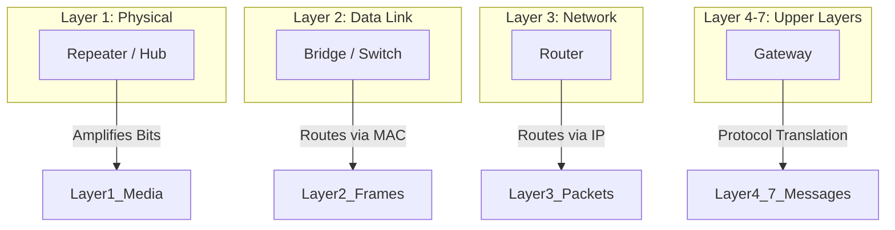

# 2024A_FE-A_23

Which of the following is an appropriate description of a device that connects LANs?

a) A bridge relays frames based on IP addresses.
b) A gateway converts the protocols of only the first through third levels in the OSI basic reference model.
c) A repeater extends the transmission distance by amplifying signals between segments of the same type.
d) A router relays frames based on MAC addresses.
?
c) A repeater extends the transmission distance by amplifying signals between segments of the same type.

### Explanation

Network devices operate at different layers of the **OSI (Open Systems Interconnection) model** to interconnect LANs. Understanding which device corresponds to which layer is crucial.

#### Network Interconnection Devices

| Device | OSI Layer | Data Unit | Description |
| :--- | :--- | :--- | :--- |
| **Repeater / Hub** | Layer 1 (Physical) | Bits | Amplifies and regenerates electrical or optical signals to extend transmission distance. |
| **Bridge / Switch** | Layer 2 (Data Link) | Frames | Forwards data based on **MAC addresses** (Hardware addresses). |
| **Router** | Layer 3 (Network) | Packets | Forwards data between different networks based on **IP addresses** (Logical addresses). |
| **Gateway** | Layer 4-7 (Transport to Application) | Messages | Converts protocols across all layers (especially upper layers) to connect entirely different architectures. |

#### Evaluating the Options

1. **Option a:** Incorrect. A **bridge** relays frames based on **MAC addresses**, not IP addresses. (A router uses IP addresses).
2. **Option b:** Incorrect. A **gateway** operates at **all levels**, up to the Application layer (Layer 7), to translate between completely different systems (e.g., an email gateway). 
3. **Option c:** **Correct.** A **repeater** operates at the Physical layer to reshape and amplify signals, extending the LAN's physical reach.
4. **Option d:** Incorrect. A **router** relays packets based on **IP addresses**. (A bridge or switch uses MAC addresses).

#### OSI Layer Interaction

