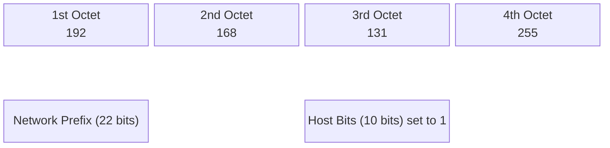

# 2024A_FE-A_24

What is the broadcast address of the network 192.168.128.0/22?

a) 192.168.128.127
b) 192.168.128.255
c) 192.168.131.255
d) 192.168.255.255
?
c) 192.168.131.255

### Explanation

To find the broadcast address of a network, we need to determine the network portion and the host portion of the IP address using the subnet mask.

The given network is **192.168.128.0 / 22**.
The `/22` notation (CIDR) means the first $22$ bits represent the network prefix, leaving $32 - 22 = 10$ bits for the host portion.

#### Step 1: Analyze the Subnet Mask
A `/22` subnet mask has 22 ones followed by 10 zeros.
- Binary: `11111111 . 11111111 . 11111100 . 00000000`
- Decimal: `255.255.252.0`

#### Step 2: Analyze the Network Address in Binary
Let's convert the given IP address `192.168.128.0` to binary, focusing on the interesting 3rd octet.

| Octet | 1st | 2nd | 3rd | 4th |
| :--- | :--- | :--- | :--- | :--- |
| **Decimal** | 192 | 168 | 128 | 0 |
| **Binary** | `11000000` | `10101000` | `10000000` | `00000000` |

The subnet boundary is at the 22nd bit (inside the 3rd octet).
- 3rd Octet Binary of 128: `100000 | 00` (First 6 bits are network, last 2 are host)
- 4th Octet Binary of 0: `00000000` (All 8 bits are host)

#### Step 3: Calculate the Broadcast Address
The **broadcast address** is found by setting **all host bits to 1**.

- Host bits to flip to 1: The last 2 bits of the 3rd octet and all 8 bits of the 4th octet.
- 3rd Octet changes from `100000 | 00` $\rightarrow$ `100000 | 11` = $128 + 2 + 1 = 131$.
- 4th Octet changes from `00000000` $\rightarrow$ `11111111` = $255$.

| Octet | 1st | 2nd | 3rd | 4th |
| :--- | :--- | :--- | :--- | :--- |
| **Network Address** | 192 | 168 | 128 (`100000 00`) | 0 (`00000000`) |
| **Broadcast Address** | 192 | 168 | 131 (`100000 11`) | 255 (`11111111`) |

Thus, the broadcast address is **192.168.131.255**.
