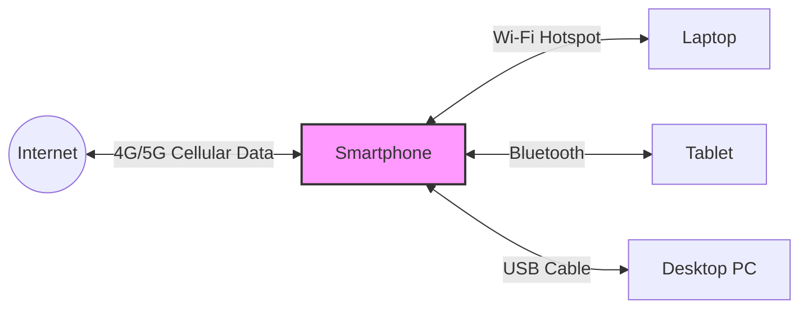

# 2024A_FE-A_26

Which of the following is the way of using a phone to supply an Internet connection to other devices, such as a tablet or laptop computer over either Wi-Fi or Bluetooth?

a) Dedicated mobile hotspots
b) PPPoE
c) Tethering
d) UPnP
?
c) Tethering

### Explanation

**Tethering** is the process of sharing a mobile device's cellular internet connection with other connected computers or devices. Connection sharing can be achieved via Wi-Fi, Bluetooth, or a physical USB cable.

#### Breakdown of Options

| Term | Description |
| :--- | :--- |
| **Dedicated mobile hotspots** | These are standalone, portable hardware devices specifically built to share a cellular connection over Wi-Fi (e.g., MiFi devices), unlike tethering which uses a general-purpose smartphone. |
| **PPPoE** (Point-to-Point Protocol over Ethernet) | A network protocol for encapsulating Point-to-Point Protocol (PPP) frames inside Ethernet frames, commonly used for DSL internet connections. |
| **Tethering** | Using a smartphone's existing cellular data plan to act as a router/modem for other devices (tablets, laptops) via Wi-Fi, Bluetooth, or USB. |
| **UPnP** (Universal Plug and Play) | A set of networking protocols that permits networked devices to seamlessly discover each other's presence and establish functional network services (e.g., discovering printers on a LAN). |

#### Visualizing Tethering

