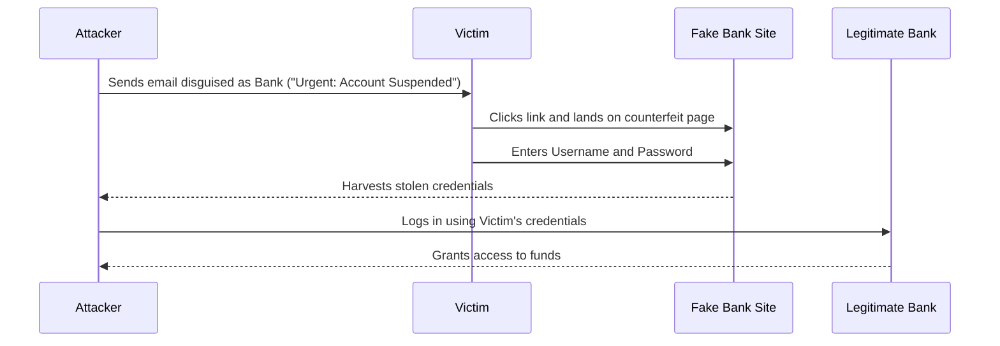

# 2024A_FE-A_27

Which of the following is an example of a phishing email?

a) An email containing pop-up ads for products unrelated to the email
b) An email intercepted, altered, and successfully sent
c) An email with a link that automatically installs an application collecting and sending data to the remote server
d) An email with a link that redirects to a fake banking site
?
d) An email with a link that redirects to a fake banking site

### Explanation

**Phishing** is a form of social engineering where an attacker sends a fraudulent message designed to trick a person into revealing sensitive information (such as passwords or credit card numbers) or to deploy malicious software. A classic phishing attack masquerades as a trusted entity (like a bank) and lures the victim to a fake webpage.

#### Analyzing the Options

| Option | Attack / Concept Name | Explanation |
| :--- | :--- | :--- |
| **a** | **Spam / Adware** | Sending unsolicited marketing emails or pop-up ads is generally classified as spam or adware, not phishing. |
| **b** | **Man-in-the-Middle (MitM) / Email Interception** | Intercepting and altering a message in transit violates message integrity and confidentiality, but it is not phishing. |
| **c** | **Malware / Trojan Downloader** | An email that silently installs malware (like spyware or a trojan) via a malicious link or attachment is a malware distribution technique. |
| **d** | **Phishing** | Forging an email to look like a legitimate service (e.g., a bank) and tricking the user into clicking a link that leads to a counterfeit login page to steal credentials is the exact definition of phishing. |

#### Anatomy of a Phishing Attack

