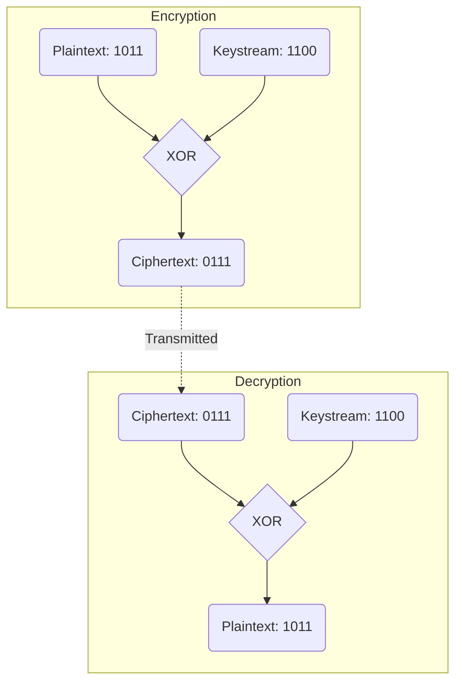

# 2024A_FE-A_28

Which of the following bitwise logical operation can be applied in stream cipher between a plain-text and a keystream to produce a cipher-text, and between a ciphertext and the keystream to recover the plaintext?

a) AND
b) NAND
c) OR
d) XOR
?
d) XOR

### Explanation

In cryptography, specifically in **stream ciphers** (like RC4 or ChaCha20), the plaintext is combined with a pseudorandom cipher digit stream (keystream). The exclusive-OR (**XOR**) logical operation is universally used for this combination because of its unique mathematical property: it is fully reversible simply by applying it a second time.

#### The Reversibility Property of XOR
Let $P$ be the plaintext bit, $K$ be the keystream bit, and $C$ be the ciphertext bit. 
The XOR operation is denoted by the symbol $\oplus$.

**Encryption:** 
$$ C = P \oplus K $$

**Decryption:** 
To recover the plaintext, the ciphertext is XORed with the exact same keystream bit:
$$ C \oplus K = (P \oplus K) \oplus K $$
Since any value XORed with itself is $0$ ($K \oplus K = 0$), and anything XORed with $0$ is itself:
$$ (P \oplus K) \oplus K = P \oplus (K \oplus K) = P \oplus 0 = P $$

#### Truth Table for Encryption and Decryption

| Plaintext ($P$) | Keystream ($K$) | Ciphertext ($C = P \oplus K$) | Decryption ($C \oplus K$) |
| :---: | :---: | :---: | :---: |
| 0 | 0 | **0** | **0** |
| 0 | 1 | **1** | **0** |
| 1 | 0 | **1** | **1** |
| 1 | 1 | **0** | **1** |

Notice that the Decryption column perfectly matches the Plaintext column.

#### Why other operations fail:
- **AND:** $1 \text{ AND } 0 = 0$, $0 \text{ AND } 0 = 0$. You cannot determine if the plaintext was $1$ or $0$ because data is lost.
- **OR:** $1 \text{ OR } 1 = 1$, $0 \text{ OR } 1 = 1$. Again, information is lost; you cannot reverse the process.

